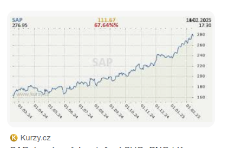

# All those riddles 

This web contains an introduction to Kullback-Leibler (KL) divergence. Specifics of what we cover are [at the bottom](what-this-course-covers) together with [what we assume you know](what-we-assume), but let's start with something more exciting. We want to tell you several riddles and hope that you get [nerd-sniped](https://xkcd.com/356/) by some of them!

<Expand headline="Why polling sucks">

Before each US elections, we want to have a guess at which of the two parties is going to win the popular vote. This is why we have polling; you can for example look at [this Wikipedia page](https://en.wikipedia.org/wiki/Nationwide_opinion_polling_for_the_2024_United_States_presidential_election) list hundreds of polls made before the last election. A typical poll asks about 1000-2000 random people. If you crunch the numbers, you can find out that this means that the output of the poll is typically about 2-3\% from the correct answer. <Footnote>Of course, all the discussion holds under unrealistic assumptions such as we can sample a random voter, they are truthful, etc. But bear with us.</Footnote> This is astonishing! Regardless of how many people live in the country, 1000 random citizens are enough to get the answer within a few percent.

But in reality, all US elections are incredibly close; we already know in advance that both Democrats and Republicans are going to get around 50%. So we should perhaps get a bigger sample (or pool several past polls) to get an estimate that's correct within, let's say, $0.1\%$. The question is, roughly how many people should we sample to get this improved precision?

1. about 10 000
2. about 100 000
3. about 1 000 000

The correct answer is about 1 000 000. That's already a nontrivial proportion of the whole US! In general, if we want to be close up to an error of $\epsilon$, we need about $1/\epsilon^2$ samples. This means that getting better estimates becomes very expensive very soon! This is one reason why most polling estimates don't bother asking more than a few thousand people.

The question is: why $1/\epsilon^2$? We'll explore this in later sections. {/* KL divergence measures how well one distribution matches another, which is why understanding its value for distributions (50%, 50%) and (50%+$\varepsilon$, 50%-$\varepsilon$) is going to shed a lot of light on this question! We will also use this as a jumping bridge to explain a bit more on how KL divergence is crucial in statistics. */}
</Expand>

<Expand headline="How S&P looks like"> 

This picture shows the price of S&P<Footnote>If you don't know what that is, think of the price of Bitcoin, Apple, or the exchange rate of USD/EUR</Footnote>.

Every day, the price jumps a little bit. I downloaded the historical data, computed the daily jumps, and plotted them in a histogram plot -- the x-axis is the size of the jump (positive roughly 50%, otherwise negative) and the y-axis is the frequency of that jump. Before I show you the plot, I want you to guess how this is going to look like:

1. Laplace
2. normal
3. střecha

This was a trick question because both answers are kind of true! The shape of the histogram depends on something I did not tell you -- how far in the past did I look to collect the data. Try it for yourself both for S&P and Bitcoin:

[TODO widget, přidat usd/eur?]

At the beginning, it seems that distribution looks a lot like the familiar bell-shaped curve <Math math="e^{-x^2}" /> of [normal distribution](https://en.wikipedia.org/wiki/Normal_distribution). This makes sense! The price of a stock slightly increases whenever somebody buys it, and slighlty decreases whenever somebody sells. The daily change is a summation of bazilions of buys and sells, and this is the setup in which we can apply the so-called [Central limit theorem](https://en.wikipedia.org/wiki/Central_limit_theorem), that says that in this case, the resulting distribution should be normal.

So how come that as we keep zooming out, the histogram gets more and more "pointy"? The other distribution is the so-called Laplace distribution with shape <Math math="e^{-|x|}" /> and it starts to be a better fit after around ?? months for S&P, and ?? for Bitcoin.

There are two ways for how this connects to KL divergence. First of all, KL divergence measures how well a ground truth distribution (empirical data we collected) is fitted by a model (normal or Laplace distribution), so you can use it to make claims such as "for more than ?? months, Laplace fits the data better than normal".

Second, we will use KL divergence to understand a deep principle in probability called maximum entropy principle. This will help us gain a lot of intuition for what both normal and Laplace distributions stand for.
</Expand>

<Expand headline="Average foot"> 

In the ye olden days, people measured lengths in feet. Different people of course have differently-sized body parts, so at some point we have to be a bit more precise. One way is to measure the foot of the local warlord, but then you have to change it every now and then when the warlord is replaced.

Another way (depicted in the above 16-th century engraving from Germany) is to ask 16 random people and compute their mean foot length as
$$\bar X = \frac{1}{16} (X_1 + \dots + X_{16})$$
This will be a fairly stable estimate that will hopefully remain similar the next time you perform this experiment.

How good is this estimate? Typically, one would gauge it by estimating the standard deviation. Do you remember the formula for that? Try to guess the correct one:

1. $$\bar \sigma^2 = \frac{1}{15} \sum_{i=1}^{16} (X_i - \bar X)^2$$
2. $$\bar \sigma^2 = \frac{1}{16} \sum_{i=1}^{16} (X_i - \bar X)^2$$
3. $$\bar \sigma^2 = \frac{1}{17} \sum_{i=1}^{16} (X_i - \bar X)^2$$

Another trick question since all formulas are correct! Or a bit more precisely, all of them are defensible in the framework of (frequentist) statistics.
The coefficient $1/(n-1)$ corresponds to the so-called unbiased estimate, $1/n$ gives the maximum likelihood estimate, and $1/(n+1)$ minimizes the mean squared error between the guess and the correct value.

But out of all these philosophies of how to estimate values, only one of them -- maximum likelihood estimation -- became the main workhorse of machine learning. Using KL, we will see why the maximum likelihood philosophy stands out.
</Expand>

<Expand headline="How to train your LLM"> 

[TODO image: "my name is A", two distributions]

So you want to train a good large language model (LLM) like GPT/Gemini/Claude. Such a model is given some text as input, does some computation inside, and outputs the next letter<Footnote>In fact, it outputs the next token. But a token is just a small group of letters -- think of it as a syllable or a short word. </Footnote> in the text.
LLMs are in fact designed so that they don't output a single letter, but try to predict the distribution $p$ of the next letter. This is why it's simple to make LLMs output different answers on the same text.

{/* We want to train a new model that is at least as good as, say, GPT-4. In practice, this would involve collecting a lot of text and running both GPT-4 and our LLM on them -- for each predicted letter, we would look at the distribution outputted by GPT-4 and try to nudge our model to make its distribution look similar. */}

There are many complicated things going on in training of LLMs, but one particularly important one is the choice of the so-called _loss function_. To understand this, let's say that for some text that appears all over the place on the internet, like "My name is A", we know the distribution of the next letter. Perhaps "l" is frequent because of Alex, but "a" not so much. Let's call this ground-truth distribution $p$.

We also know the distribution that our LLM outputs, let's call it $q$. We need to measure how well $q$ matches $p$. This way, we derive the loss function -- the function that we try to minimize during the LLM training. So which one would you choose?

1. $L(p,q) = \sum_{i = 1}^n |p_i - q_i|$ (_$\ell_1$ norm_)
2. $L(p,q) = \sum_{i = 1}^n (p_i - q_i)^2$ (_$\ell_2$ norm_)
3. $L(p,q) = \sum_{i = 1}^n p_i \cdot \log (p_i / q_i)$ (_KL divergence_)

There is nothing wrong with the first two functions, in practice, people usually opt for KL divergence. An important feature of it is that according to KL, if $p_i = 0.5$ and $q_i = 0.51$, it's in some sense a smaller problem than if $p_i = 0.01$ and $q_i = 0.02$ (the ratios $p_i/q_i$ end up very different). Sounds reasonable!

Here's a widget with two distributions and all three loss functions. Try to make KL infinitely large!

[TODO widget]
</Expand>

<Expand headline="How good are your predictions?"> 

It would be great to know what the future holds—or at least to know someone who does. To this end, you have gathered a bunch of experts and asked them to assign probabilities to a list of events for the coming year. Each expert provides an estimate for each event.
When the year ends, you know for each event whether it occurred or not.

[TODO table]

The question is, which expert is the best one?

1. Expert 1
2. Expert 2
3. Expert 3

Answer: It depends! In practice, people use one of two scoring rules, the Brier score or log-score. The two scores penalize you differently if you claim that an event probably won't happen, but it does -- see e.g. the ?? column. Brier does not care much whether your guess was 1%, 0.1%, or even 0% but log score does. In fact, if you estimate that an event has 0% probability and then it happens, log-score says you are infinitely bad!

We will see how KL divergence explains why log-score is natural and what it stands for.
</Expand>

<Expand headline="Distance from independence"> 

Independence is one of the most important probability concepts. Here's a recap: think of two distributions $p_1$ and $p_2$. Maybe $p_1$ describes the weather on a given day -- the options are ☀️, ☁️, and $p_2$ describes how I commute to work -- it's one of 🚶‍♀️, 🚲, 🚌. A joint distribution is a table where we put a probability for each pair of options. For example, here are three possible joint distributions for three different people:

All three above distribution have the same _marginals_; all correspond to 70% of good weather, and 20%/30%/50% for walk/bike/bus.

Two distributions are independent, if the joint distribution is a "product" of the two marginal distributions. Here's how independent distribution looks like:

Which of our three tables is the "closest" to being independent?

1. Table 1
2. Table 2
3. Table 3

[We will see](01-kl_intro/information-theory) that this can be measured using a so-called mutual information, a notion which is super important in the field of information theory and which is just a special case of KL divergence.
</Expand>

<Expand headline="Machine Learning mess"> 

When you first encounter machine learning, it seems like horrible mess, full of ad-hoc tricks and optimization problems. For example, here are a few machine learning tools you learn in the first few Machine-Learning-101 lectures, and what optimization they correspond to:

<Math math="k\text{-means -- } \min_{C} \sum_{i = 1}^{n} \min_{c \in C} ||x-c||^2" />
<Math math="\text{linear regression -- } \min_{\alpha, \beta} \sum_{i = 1}^n (\alpha \cdot x_i + \beta - y_i)^2" />
<Math math="\text{logistic regression -- } \min_{\alpha, \beta} \sum_{i = 1}^n y_i\log(\sigma(\alpha \cdot x_i + \beta)) + (1-y_i)\log(1 - \sigma(\alpha \cdot x_i + \beta))" />

When you try to understand some more modern deep learning tools, it does not get that much better. For example, consider variational autoencoders (the architecture behind early image generation models like DALL-E / Midjourney as of time of writing). During training, you optimize the following beast:

<Math displayMode={true} math="
E_{z \sim p_x}[||x-D(z)||^2] + \sum_{j = 1}^d (d\cdot \sigma_j^2(x) + \mu_j^2 - 2d\log \sigma(x))
" />

Although these functions look horrible, we will see what they correspond to and how they can be derived using KL divergence.
</Expand>

<Expand headline="How to get rich"> 

Here's a riddle that motivates a surprising number of recent algorithms in computer science and machine learning. Let's say that we want to get rich by investing at the stock market. Fortunately, there are $n$ investors that are willing to share their advice with us: Each day $t$, they give us some advice, and at the end of the day, we learn how good the advice was -- for the $i$-th expert, we will get to know her loss $\ell_i^{(t)}$ <Footnote>If this number is positive, the advice was bad, if it is negative, the advice was good. </Footnote>

Our general investing strategy is this: We start with a uniform distribution $p_1^{(0)}, \dots, p_n^{(0)}, p_i^{(0)} = 1/n$ over the experts. At the beginning of each day, we sample an expert from this distribution and follow her advice. At the end of the day, we look at the losses $\ell_i^{(t)}$ and we update $p^{(t)}$ to $p^{(t+1)}$.

The question is: how should we update? There are a few plausible strategies:

"Gradient descent": Choose small $\varepsilon$ and do gradient descent: <Math math="p^{(t+1)} = p^{(t)} - \varepsilon \cdot \ell_i^{(t)}" />; normalize <Math math="p^{(t+1)}" /> afterwards.
"Multiplicative gradient descent: Choose small $\varepsilon$ and do "multiplicative" gradient descent: <Math math="p^{(t+1)} = p^{(t)} \cdot e^{- \varepsilon \cdot \ell_i^{(t)}}" />; normalize <Math math="p^{(t+1)}" /> afterwards.
"Follow the leader": Just follow the best guy so far: <Math math="p^{(t+1)}_i = 1" /> for the guy $i$ with minimum <Math math="\ell_i^{(1)} + \ell_i^{(2)} + \dots + \ell_i^{(t)}" />.

What's the best strategy?

Answer 1
Answer 2
Answer 3

Although all strategies are reasonable, the one that turns out to be the most robust and broadly applicable is 2. The algorithm is called multiplicative weights update and its suspiciously similar to gradient descent. We will understand the connection between the two algorithms using KL divergence.
</Expand>

<Expand headline="Understanding this XKCD joke"> 

So are the odds in our favor?

Yes
No
depends
</Expand>

<Expand headline="How large is Wikipedia?">
</Expand>

<Expand headline="Random Pi Program"> 

Here's a riddle: Consider the set of all C programs of length 1000 characters (i.e., the file has 1000 bytes if saved in ASCII) that print the first million digits of $\pi$. Let's sample one such program uniformly at random. How would it probably look?
</Expand>

## Next Steps 

Each of the puzzles above might seem disconnected, but they share a common thread: they can all be approached, understood, or solved using KL divergence and related concepts.

KL divergence is a fundamental measure that quantifies how one probability distribution differs from another. Its formal definition is:

$$KL(p, q) = \sum_{i = 1}^n p_i \log \frac{p_i}{q_i}$$

Where $p$ represents the "ground-truth" distribution and $q$ represents our model or approximation.

In the upcoming sections, we'll explore this measure in depth, develop intuitions for what it stands for, and see how it connects to probability, statistics, machine learning, information theory, and more.

As we progress through the mini-course, we'll revisit these puzzles and show how they can be solved or better understood through the lens of KL divergence.

In the next part, we'll define KL divergence and understand what it stands for. [Let's begin](/01-kl_intro).

## What we assume 

You should be familiar with the basic language of probability theory: probabilities, distributions, random variables, independence, expectations, variance, standard deviation, and so on. You should understand Bayes rule and it helps to have heard about the law of large numbers, see a few examples from statistics and perhaps machine learning.

What's covered in undergrad courses in probability should be sufficient.

