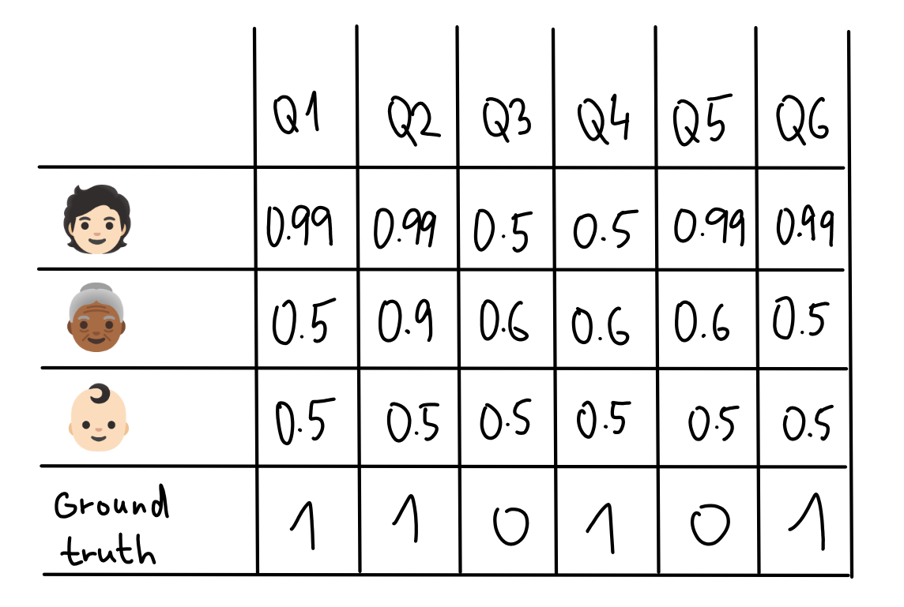
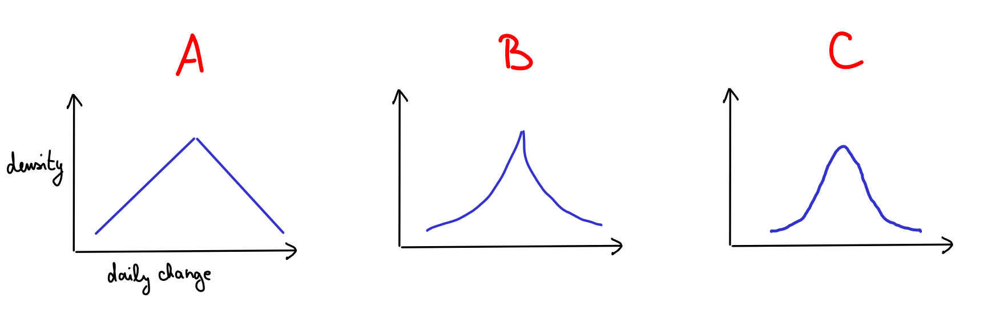
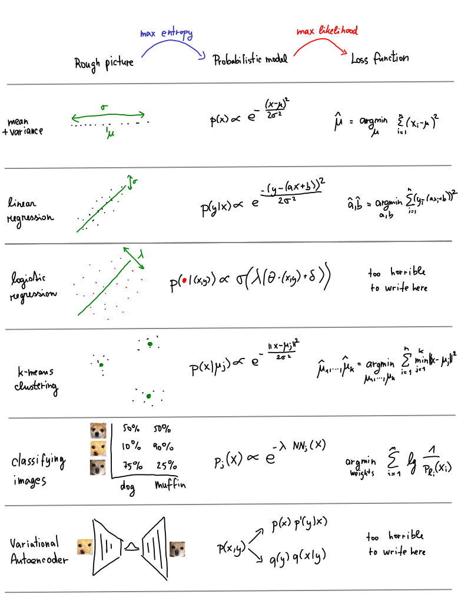

# All those riddles 

This web contains an introduction to Kullback-Leibler (KL) divergence. 
Check out [this page](about) for logistics. Here, we've got several riddles some of which will hopefully [nerd-snipe](https://xkcd.com/356/) you!

<Expand headline="🔮 How good are your predictions?"> 

It'd be awesome to know the future—or at least know someone who does. So you've gathered some experts and came up with five questions (Q1 to Q5). You ask the experts to give you probabilities for all 5 questions.
A year later, you know what actually happened and are ready to find the best expert.  

Question is: how do you find the best expert?

<MultipleChoiceQuestion
  options={["🧑 Expert 1", "👵🏿 Expert 2", "👶 Expert 3"]}
  correctIndices={[0, 1, 2]}
  feedbackType="all-show"
  explanation={<>This is actually hard to tell with just 5 questions, we would need many more of them. But I am not a big fan of 🧑 though, with his failed 99%-confidence prediction! Later, we'll see how KL divergence gives us the log-score that forecasting tournaments use; this score penalizes failed 99%-confidence predictions quite heavily!   
  <ExpertRatingWidget
    title="Log score"
    showBrierScore={false}
  />  </> }
  />
</Expand>

<Expand headline="🗳️ Why polling sucks">

A typical [US election poll](https://en.wikipedia.org/wiki/Nationwide_opinion_polling_for_the_2024_United_States_presidential_election) asks 1000-2000 random people. Do the math and you'll find such polls are usually within 2-3% of the truth.<Footnote>This assumes you can actually sample random voters, they tell the truth, etc. This is never true but stick with me.</Footnote> Pretty wild—it doesn't even matter how many people live in the country, 1000 random ones get you within a few percent!

But here's the thing: US elections are super close. We already know both parties will get around 50%. So maybe we should poll more people (or combine polls) to get within 0.1%. How many people would that take?

<MultipleChoiceQuestion
  options={["about 10,000", "about 100,000", "about 1,000,000"]}
  correctIndices={[2]}
  explanation={<>It's about 1,000,000! That's a huge chunk of the whole US! The general rule: to get error margin <Math math="\eps" />, you need roughly <Math math="1/\eps^2" /> samples. That square is killer—it's why getting better estimates gets expensive fast! No wonder most polls stick to a few thousand people.  But why <Math math="1/\eps^2" />? Explore the relationship below:  <PollingErrorCalculator /></>}
/>
</Expand>

<Expand headline="🦶 Average foot"> 

Back in the day, people measured stuff in feet. Sure, we all kinda know how long a foot is, but eventually you need to nail it down precisely. One way (shown above) is to grab 16 random people and average their foot lengths:
$$\bar X = \frac{1}{16} (X_1 + \dots + X_{16})$$

This gives you a pretty stable number that shouldn't change much if you do it again. To measure how good your estimate is, you'd usually calculate the standard deviation. Remember the formula? Which one's right:

<MultipleChoiceQuestion
  options={[
    <Math math="\bar{\sigma}^2 = \frac{1}{15} \sum_{i=1}^{16} (X_i - \bar{X})^2" />,
    <Math math="\bar{\sigma}^2 = \frac{1}{16} \sum_{i=1}^{16} (X_i - \bar{X})^2" />,
    <Math math="\bar{\sigma}^2 = \frac{1}{17} \sum_{i=1}^{16} (X_i - \bar{X})^2" />
  ]}
  correctIndices={[0, 1, 2]}
  feedbackType="all-show"
  explanation={<>In a sense, they're all correct! Well, more like they're all defensible options from the viewpoint of frequentist statistics. Using <Math math="1/(n-1)" /> gives you the <a href="https://en.wikipedia.org/wiki/Bias_of_an_estimator">unbiased estimate</a>, <Math math="1/n" /> gives the <a href="https://en.wikipedia.org/wiki/Maximum_likelihood_estimation">maximum likelihood estimate</a>, and <Math math="1/(n+1)" /> minimizes <a href="https://en.wikipedia.org/wiki/Mean_squared_error">the mean squared error</a> between your guess and the truth.  But here's the thing: out of all these ways to estimate stuff, only maximum likelihood became the rockstar of machine learning. Using KL divergence, <a href="03-minimizing#mle">we'll see</a> why maximum likelihood is so special and what makes it tick.</>}
/>
</Expand>

<Expand headline="📈 S&P shape"> 

{/*  */}

Every day, the S&P index price jumps around a bit. <Footnote>If you don't know what the S&P is, just think Bitcoin, Apple stock, or how many euros you can buy with a dollar</Footnote>

I grabbed some historical data, calculated the daily price changes, and threw them in a histogram. The x-axis shows how big the change was (positive about half the time, negative the other half) and the y-axis shows how often that size change happens. Before I show you the plot, take a guess—what's it gonna look like? 

<MultipleChoiceQuestion
  options={["A", "B", "C"]}
  correctIndices={[1, 2]}
  feedbackType="all-show"
  explanation={<>Trick question—both shapes B (Laplace distribution) and C (Gaussian distribution) kind of work! The shape totally depends on something I didn't tell you: how far back I looked. If you only check the last month, shape C fits better (though in that case it's hard to judge). But zoom out to longer periods and it starts looking more like B. 
  <FinancialDistributionWidget showBTC={false} showSAP={true} />
  What's up with that? We will see in the <a href="04-max_entropy">chapter about the max-entropy principle</a>.  </>}
/>

[We'll use KL divergence](04-max_entropy#application-understanding-financial-data) to understand this deep principle in probability called the maximum entropy principle. It'll give us tons of intuition about modeling this kind of data and what those different shapes actually mean. 
</Expand>

<Expand headline="💰 How to get rich"> 

Here's a riddle that's behind a ton of recent algorithms in CS and ML. Say you wanna get rich trading stocks. Lucky you—$n$ investors share their tips every day. Each day $t$, they give advice, and afterward you find out how they did. For investor $i$, you get $g_i^{(t)}$ - how many dollars she gained that day.

Your strategy: Start with equal trust in everyone—$p_i^{(0)} = 1/n$ for all investors. Each morning, randomly pick an investor based on your trust distribution and follow their advice. After seeing how everyone did, update your distribution to $p^{(t+1)}$.

How should you update? What's best?

<MultipleChoiceQuestion
  options={[
    <>Proportional sampling: <Math math="p_i^{(t+1)} \propto \ell_i^{(1)} + \dots + \ell_i^{(t)}" /></>,
    <>Multiplicative sampling: <Math math="p_i^{(t+1)} \propto e^{\eps \cdot \left( \ell_i^{(1)} + \dots + \ell_i^{(t)} \right) }" /> for some small <Math math="\eps" /></>,
    <>"Follow the leader: Go with the expert that has the largest gain so far"</>
  ]}
  correctIndices={[1]}
  explanation={<>All options are reasonable, but option 2 is the most robust. It's called multiplicative weights update, and it looks weirdly like gradient descent. <a href="06-algorithms">We'll see</a> how KL divergence explains the connection.  Try it yourself with the widget below:  <MWUWidget /></>}
/>
</Expand>

<Expand headline="🧠 LLM training"> 

So you wanna train a large language model (LLM) like GPT/Gemini/Claude. These beasts take text, do some crazy computations, and spit out the next letter (Well, actually the next [token](https://en.wikipedia.org/wiki/Large_language_model#Tokenization), which is like a little chunk of letters).
LLMs don't just guess a single letter—they predict the whole distribution $p$ of what might come next. 

{/* We want to train a new model that is at least as good as, say, GPT-4. In practice, this would involve collecting a lot of text and running both GPT-4 and our LLM on them -- for each predicted letter, we would look at the distribution outputted by GPT-4 and try to nudge our model to make its distribution look similar. */}

Training LLMs is complicated as hell, but one super important bit is picking the _loss function_. Here's the deal: take some text that shows up everywhere online, like "My name is A". We know what usually comes next—maybe "l" is common (all those Alexes), but "a" not so much. Call this the ground-truth distribution $p$.

Your LLM tries to guess this distribution with its own guess $q$. We need to measure how close $q$ is to $p$ using a loss function, then make that number as small as possible during training. So given distributions $p = \{p_1, \dots, p_k\}$ and $q = \{q_1, \dots, q_k\}$, which loss function should we pick?

<MultipleChoiceQuestion
  options={[
    <><Math math="\mathcal L(p,q) = \sum_{i = 1}^k |p_i - q_i|" /></>,
    <><Math math="\mathcal L(p,q) = \sum_{i = 1}^k (p_i - q_i)^2" /></>,
    <><Math math="\mathcal L(p,q) = \sum_{i = 1}^k p_i \cdot \log (p_i / q_i)" /></>
  ]}
  correctIndices={[2]}
  explanation={<>The first two work okay, but practioners typically use KL divergence. Here's why it's nice: if <Math math="p_i = 0.5" /> and <Math math="q_i = 0.49" />, KL thinks that's basically fine. But if <Math math="p_i = 0.01" /> and <Math math="q_i = 0.0" />, KL freaks out (the ratio <Math math="p_i/q_i" /> is infinite). On the other hand, the other two loss functions think both situations are similar problem.   Check out this widget with two distributions and all three loss functions.   <DistributionComparisonWidget title="KL Divergence Explorer" /></>}
/>
</Expand>

<Expand headline="🔗 Distance from independence"> 

Independence is huge in probability. Quick refresher: you've got two distributions $p_1$ and $p_2$. Maybe $p_1$ is about weather (☀️ or ☁️) and $p_2$ is how I get to work (🚶‍♀️, 🚲, or 🚌). A joint distribution is a table showing the probability of each combo. Here are three possible joint distributions for three different people:

All three have the same _marginals_: 70% good weather, and 20%/30%/50% for walk/bike/bus.

Two distributions are independent if their joint distribution equals the product of the marginals. Here's what independence looks like:

Which of our three tables is "closest" to being independent?

<MultipleChoiceQuestion
  options={["Table 1", "Table 2", "Table 3"]}
  correctIndices={[1]}
  explanation={<><a href="01-kl_intro#information-theory">We'll see</a> this is measured by something called mutual information, which is super important in information theory and—surprise!—it's just KL divergence in disguise.  Try it yourself with the interactive widget below:  <MutualInformationWidget /></>}
/>
</Expand>

<Expand headline="🤓 Understanding XKCD jokes"> 

So... are the odds in our favor?

<MultipleChoiceQuestion
  options={["Yes", "No", "depends"]}
  correctIndices={[1, 2]}
  explanation={<>We'll use KL divergence to derive an important tool called the <a href="04-max_entropy">maximum entropy principle</a>. This will allow us to understand various distributions and construct new ones from scratch. We will use the principle to explain our gut feeling that we are not necessarily fine here.
  </>}
/> 
</Expand>

<Expand headline="🌐 How large is Wikipedia?">
Marcus Hutter, an AI researcher, started <a href="http://prize.hutter1.net/">this challenge</a>: Take a 1GB file of Wikipedia text. How small can you compress it? <a href="https://en.wikipedia.org/wiki/ZIP_(file_format)">Zipping it</a> gets you about 300MB. But we can do way better. What's the current record? 

<MultipleChoiceQuestion
  options={["around 1MB", "around 10MB", "around 100MB"]}
  correctIndices={[2]}
  explanation={<>It's around 100MB. But wait—why does an <em>AI</em> researcher care about compression? We'll see the connection with <a href="02-crossentropy/coding">entropy</a>, <a href = "02-crossentropy/hutter">next token prediction</a>, and <a href="#">Kolmogorov complexity</a>.</>}
/> 
</Expand>

<Expand headline="🤯 Machine Learning mess"> 

When you first dive into machine learning, it looks like total chaos—just a bunch of random tricks and optimization problems. Like, say you wanna understand how DALLE or Midjourney work. The standard setup for image generation is called a variational autoencoder. You train it by optimizing this absolute monster: 

<Math displayMode={true} math = "\frac{1}{N} \sum_{i = 1}^N \left( \sum_y p'(y | x) \frac{\| X_i - \textrm{Dec}(y)\|^2}{2d} \,+\, \left( \frac12 \sum_{j = 1}^d \textrm{Enc}_{\mu, j}(X_i)^2 + \textrm{Enc}_{\sigma^2, j}(X_i) - \log \textrm{Enc}_{\sigma^2, j}(X_i) \right)\right)"/>

Where the hell does this come from?? [We'll see](05-machine_learning) how KL divergence makes sense of this mess—and tons of other standard ML algorithms too. 

</Expand>

## Next Steps 

All these puzzles have something in common: you can crack them using KL divergence and related ideas from probability, statistics, and information theory. 

{/*KL divergence is a fundamental measure that quantifies how well one probability distribution is modelled by another. Formal definition: $D(p, q) = \sum_{i = 1}^n p_i \log \frac{p_i}{q_i}$. Here, $p$ represents the "ground-truth" distribution and $q$ represents our model or approximation.*/}

As we go through this mini-course, we'll use KL to revisit each puzzle and really understand what's going on. 

The mini-course has five chapters. 

1. In the first chapter, we learn what KL divergence stands for and why it is tightly connected to Bayes' rule. 
2. In the second chapter, we will understand the properties of KL divergence and its friends cross-entropy and entropy. 
3. In the third chapter, we will understand how two ways of minimizing KL divergence leads to two super-important statistical principles: maximum likelihood and maximum entropy. 
4. In the fourth chapter, we will understand the max entropy principle and its applications. 
5. In the fifth chapter, we will apply all our tools to understand loss functions in machine learning and deep learning. 

See you in [the first chapter](01-kl_intro)!