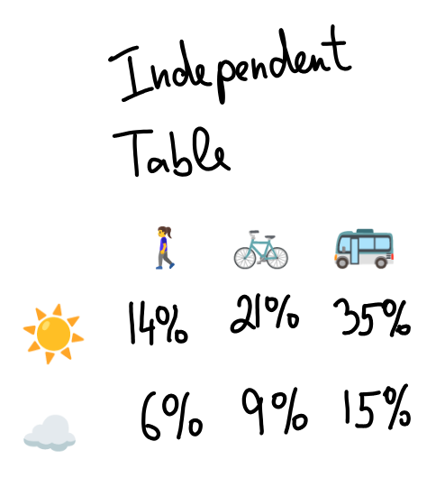

# KL divergence & Bayes rule 

In this chapter, we'll break down what KL divergence is and how it's tied to Bayes' theorem. Plus, we'll solve some riddles.

<Block headline = "If there is one thing you remember from this chapter...">
KL divergence measures how well a distribution $p$ is fitted by a model distribution $q$.
</Block>

## Definition of KL divergence 

Here's the deal with KL divergence. <Footnote>KL stands for Kullback and Leibler, two smart cookies who came up with this in the 1950s, right after Claude Shannon dropped his [game-changing paper](https://en.wikipedia.org/wiki/A_Mathematical_Theory_of_Communication) about entropy.</Footnote>

Think of it like a wonky distance measure between two distributions.

Here's the formula for discrete distributions $p_1, \dots, p_n$ and $q_1, \dots, q_n$:<Footnote> Most people write $D_{KL}(p||q)$ instead of $D(p,q)$. The double bars are there to remind you that $D_{KL}(p||q) \not= D_{KL}(q||p)$. We'll keep it simple with $D(p,q)$ since we'll be using this a lot. 🙂 </Footnote><Footnote>When we write $\log$, we mean base-2 logarithm. </Footnote>

$$
D(p,q) = \sum_{i = 1}^n p_i \log \frac{p_i}{q_i}
$$

What's this actually mean? When you keep sampling from the true distribution $p$, KL divergence tells you how fast you can figure out you're sampling from $p$ and not some other distribution $q$. Small KL = $q$ is a pretty good fake of $p$.

Let me break this down properly.

## Bayes' theorem

Before we dive into KL, let's refresh on Bayes' theorem—it's how you update your beliefs when you get new info. Example time:

You've got a coin that might be rigged. To keep it simple, let's say there are only two options: it's either fair (50/50 for heads/tails) or it's biased toward tails (25% heads, 75% tails).

To use Bayes, you need a starting guess (a _prior_) about which it is. Let's say you think there's a 2/3 chance it's fair and 1/3 chance it's biased.

You flip the coin—Heads! This is evidence for the fair coin (since heads are more likely with a fair coin). But how do we calculate the new probability (the _posterior_) that it's fair?

Bayes' theorem to the rescue! The usual way this rule is written is like this:

<Math displayMode={true} math='P(\textrm{fair} | \textrm{heads}) = \frac{P(\textrm{heads} | \textrm{fair}) \cdot P(\textrm{fair})}{P(\textrm{heads})}' />

No big deal—multiply both sides by $P(\textrm{heads})$ and you'll see both sides are just <Math math = "P(\textrm{fair AND heads})" />.

But I like to think about it differently:

<Math displayMode={true} math='\underbrace{\frac{P(\textrm{fair} | \textrm{heads})}{P(\textrm{biased} | \textrm{heads})}}_{\textrm{Posterior odds}} = \underbrace{\frac{P(\textrm{fair})}{P(\textrm{biased})}}_{\textrm{Prior odds}} \cdot \underbrace{\frac{P(\textrm{heads} | \textrm{fair})}{P(\textrm{heads} | \textrm{biased})}}_{\textrm{Likelihood ratio}}' />

This is pretty much just a different way of writing down the Bayes' rule. <Footnote>Why? Use the first formula for both $P(\textrm{fair} | \textrm{heads})$ and $P(\textrm{biased} | \textrm{heads})$, then divide 'em. </Footnote> To get this version, think in [odds](https://en.wikipedia.org/wiki/Odds) instead of probabilities. Gamblers love this—instead of "1/3 chance of this, 2/3 chance of that," they say "odds are 1:2." Odds don't need to add to one (1:2 is the same as 2:4), which is handy when you don't wanna mess with normalizing.

With odds, Bayes' formula is super clean! You just multiply your prior odds by <Math math = "\frac{P(\textrm{heads} | \textrm{fair})}{P(\textrm{heads} | \textrm{biased})}" />—that's how much more likely heads are under each hypothesis. These conditional probabilities <Math math = "P(\textrm{event} | \textrm{hypothesis})" /> are called [_likelihoods_](https://en.wikipedia.org/wiki/Likelihood_function), so this ratio is the likelihood ratio.

Here's how it works in practice: <Footnote>Getting Bayes' rule is super important. If this isn't clicking, check out [this explainer](https://www.lesswrong.com/w/bayes-rule). </Footnote>

<BayesCalculatorWidget />

{/*Bayes' theorem simply says we should do the simplest thing possible with the two relevant ratios -- multiply them -- to arrive at the posterior odds $P(\textrm{fair} | \textrm{heads}) : P(\textrm{biased} | \textrm{heads})$ .*/}

## Go forth and multiply

KL divergence is about what happens when you keep flipping. Picture our Bayesian hero flipping over and over, updating her beliefs each time using Bayes. If she gets $\{H, T, T, H, T\}$, here's what's happening:

<BayesSequenceWidget />

Every flip, she multiplies her odds by a likelihood ratio: $2/1$ for heads, $2/3$ for tails.

In this example, three tails out of five slightly favor the biased coin. After converting back to probabilities, her initial 67% belief in fairness drops to about 64%. Gonna need way more flips to know for sure!

## Measuring evidence in bits

Before we see what happens long-term, let's switch gears. <Footnote>No pun intended. </Footnote> We'll take logs of everything so we can add instead of multiply. Instead of multiplying odds, we just add log-odds—much simpler arithmetic!

Here's the same step-by-step sequence in log space:

<BayesSequenceLogWidget />

The key insight is _[surprisal](https://en.wikipedia.org/wiki/Information_content)_: instead of probability $p$, we write $\log 1/p$. This measures how surprised you are when something happens. Getting heads when you thought it was 1% likely? Super surprising ($\log 1/0.01 \approx 6.6$). Getting heads on a fair coin? Meh ($\log 1/0.5 = 1$).

When you subtract surprisals for the same outcome under different hypotheses, you get how much evidence that outcome provides. For our coin example, heads give you 1 bit of evidence for fair, tails give 0.58 bits for biased.

To get the final probability, add up all the surprisals for each hypothesis, exponentiate, and don't forget the prior.

In our example, the total evidence for biased is:

$$
3 \cdot 0.58 - 2 \cdot 1 = 1.74 - 2 = -0.26. 
$$

We started with one bit favoring fair, so we end up with 1.26 bits for fair. Convert that back and you get about 75% probability it's fair.

## Expected Distinguishing Evidence 

Let's say the coin actually is biased. How fast will our Bayesian hero figure this out? We can calculate the average bits learned per flip. Heads give -1 bit (negative 'cause it points the wrong way), tails give +0.58 bits. On average, each flip gives:

$$
0.25 \cdot (-1) + 0.75 \cdot 0.58 \approx 0.19
$$

bits of evidence toward the truth. Boom—that's the KL divergence between the true 25%/75% distribution and the model 50%/50% distribution!

What's this mean in practice? You need about 5.4 flips to get one bit of evidence. So if you start thinking 2:1 the coin is fair, after ~5 flips you'll be at 1:1. Another 5 flips gets you to 2:1 it's biased, then 4:1, and so on.

The actual odds bounce around this average. But thanks to the law of large numbers, after $N$ flips the total evidence will be close to $0.19 \cdot N$. <Footnote> More precisely, it's $0.19N \pm O(\sqrt{N})$. We use logs and talk about bits because the law of large numbers works for adding stuff, not multiplying. </Footnote>

Try it yourself! I recommend checking edge cases like 50% vs 51% (to get  intuition about when the law of large numbers kicks in) or what's the difference between 50% vs 1% and 1% vs 50%. 

<EvidenceAccumulationSimulator />

## KL divergence, in general

KL divergence is just the general formula for expected evidence accumulation. Say you've got two distributions $p$ and $q$, where $p$ is what's really happening:

You can repeat the experiment and play the Bayesian game: For each outcome $i$, compare the likelihoods $p_i$ and $q_i$ and update your beliefs. This means adding $\log 1/p_i$ bits to $p$'s surprise total and $\log 1/q_i$ bits to $q$'s. 

On average, each sample from the true distribution $p$ gives you:

$$
D(p,q) = \sum_{i = 1}^n p_i \cdot \log \frac{p_i}{q_i}
$$

bits of evidence toward the truth.

When this number is small (less than 1), you can think of $1/D(p,q)$ as "how many samples until I get one bit of evidence." One bit means the odds for the true hypothesis doubled. <Footnote>This isn't the same as doubling the probability. Going from 1:1 to 2:1 odds means 50% → 66.7% probability. But with lopsided odds like 1:1000, gaining a bit toward the underdog (making it 2:1000) almost doubles its probability. And gaining a bit the other way (1:2000) almost halves the underdog's probability. The truth's probability shoots up exponentially until it's comparable to the alternative, then the alternative's probability tanks exponentially. </Footnote>

Notice KL divergence is about the evidence, not your starting beliefs. It tells you how fast beliefs change, no matter where you start.
Even though we've been all Bayesian here, KL divergence doesn't pick sides—it's useful whether you're a Bayesian or frequentist statistician.

---

## Cracking some riddles

<Expand headline = "Riddle: How to train your LLM" > 

Remember [our riddle](00-introduction#deep-learning) about training a smaller language model to copy a bigger one like GPT-4? We've got the true distribution $p$ and our model's guess $q$, and we need to measure how good the match is.

That's literally what KL divergence does!

What about using $\ell_1$ norm ($\sum |p_i - q_i|$) or $\ell_2$ norm ($\sum (p_i - q_i)^2$)? They might work okay, but they've got a big problem. Check these out:

1. $p_i = 0.5, q_i = 0.49$
2. $p_i = 0.01, q_i = 0.0$

Regular norms ($\ell_1, \ell_2$) think these errors are about the same size. But KL knows better—the first one's basically fine, but the second is a total disaster!

<DistributionComparisonWidget title="KL Divergence Explorer" />

</Expand>

<Expand headline = "Riddle: Measuring distance from independence">

Back to our riddle: [How do you measure distance from independence](00-introduction#information-theory)?

Remember our three joint distributions $p_1, p_2, p_3$:

They all have the same marginals (same row and column totals). If the marginals were independent, we'd get this product distribution $q$:

Which one's "most" independent?

We need to measure how different each table is from the ideal independent one. There are tons of ways to do this<Footnote>People often use [correlation](https://en.wikipedia.org/wiki/Correlation), but that's not great. First, correlation only works for numbers, not general stuff like \{☀️, ☁️\}. Plus, zero correlation doesn't mean independence. </Footnote>, but KL divergence is perfect. We've got two distributions: the "truth" (one of our tables) and the "model" (the ideal independent table). The KL between them tells us how well the model matches reality—basically, how long until a Bayesian detective figures out the data isn't coming from the independent model.

The KL divergences for our tables:

<Math displayMode = {true} math = "D(p_1, q) \approx 0.40, D(p_2, q) \approx 0.04,  D(p_3, q) \approx 0.21"/>

So table 2 is "closest" to independence!

This works for any joint distribution $(r, s)$. The KL divergence between $(r, s)$ and the independent version $r \otimes s$ is called [mutual information](http://en.wikipedia.org/wiki/Mutual_information) between $r$ and $s$—it's huge in information theory. 

<Expand headline = "Intuition">
Intuitevely, mutual information tells you how many bits you learn about $r$ when you find out $s$ (or vice versa—it's symmetric).

For example, in the widget below, make $P(\text{☀️ AND 🚶‍♀️}) = P(\text{☁️ AND 🚲}) = \frac{1}{2}$. The mutual information is 1 bit. That's because if learning the value of one distribution, say transport, makes the entropy of the other distribution smaller by 1 bit - the weather distribution changes from a coin flip with entropy of 1 bit to either determined ☀️ or determined ☁️ with 0 entropy. 

Technically speaking, this is because the formula for mutual information can be rewritten as $I(X;Y) = H(X) - H(X|Y)$. See e.g. [Wikipedia](https://en.wikipedia.org/wiki/Mutual_information) for more discussion. 
</Expand>

{/*<MutualInformationWidget />*/}

</Expand>

## What's next?

In the [next section](02-crossentropy), we'll dig deeper into the KL formula and see how it connects to entropy and cross-entropy.