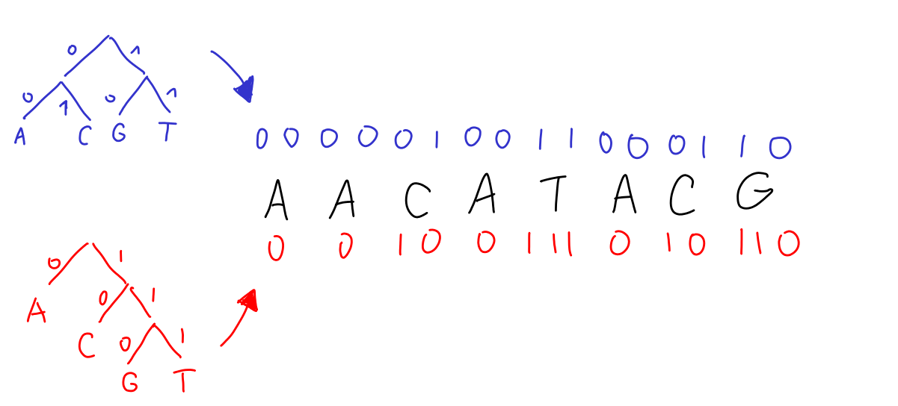

# KL properties & (cross-)entropy

In this chapter, we'll check out some nice algebraic properties of KL divergence. The most useful one is that we can split it into two pieces called _cross-entropy_ and _entropy_. 

<KeyTakeaway>

</KeyTakeaway>

## Properties of KL divergence

Let's go through some key properties of KL divergence you should know about. Remember, KL divergence is algebraically defined like this:

<Math id="kl-definition" displayMode={true} math="D(p,q) = \sum_{i = 1}^n p_i \log \frac{p_i}{q_i}" />

Heads up: KL divergence can be infinite! This happens when $q_i = 0$ but $p_i \neq 0$ for some $i$. We also use the convention $0 \cdot \log 0/0 = 0$ so that KL always gives us either a nice number or $+\infty$.

### Asymmetry

The KL formula isn't symmetrical—in general, $D(p,q) \neq D(q,p)$. Some people see this as a bug, especially when comparing KL to nice symmetric distance functions like $\ell_1$ or $\ell_2$<Footnote> <Math math='d_1(p,q) = \sum_{i = 1}^n |p_i - q_i|'/>, <Math math='d_2(p,q) = \sqrt{\sum_{i = 1}^n (p_i - q_i)^2}'/></Footnote>. But I want to stress that the asymmetry is a feature, not a bug! KL measures how well a distribution $p$ is fitted by a model $q$. That's an asymmetrical thing by nature, so we need an asymmetrical formula—nothing to be embarrassed about.

In fact, that's why we call it a _divergence_ instead of a distance—it acts kinda like a distance but isn't symmetric. <Footnote>More on that in [one of the last chapters](06-algorithms)</Footnote>

<Expand headline = "Example">
Imagine the true probability is 50%/50% (fair coin), but your model says 100%/0%. Boom—KL divergence is infinite. Why? Well, you've got a 50% chance of flipping tails, which your model says should never happen. So there's a 50% chance you'll gain infinitely many bits of information (your posterior will jump to 100% fair, 0% biased), making the divergence infinite.

Now flip it around: truth is 100%/0%, model is 50%/50%. Then $D(p,q) = 1$. Every flip gives you heads, so you gain one bit of evidence that the coin is biased. One bit is a lot and your belief in fairness drops fast, but it never hits zero. You've gotta account for the (exponentially unlikely) possibility that a fair coin just happened to give all heads.
</Expand>

### Nonnegativity

If you plug the same distribution into KL twice, you get:

<Math displayMode={true} math="D(p, p) = \sum_{i = 1}^n p_i \cdot \log \frac{p_i}{p_i} = 0" />

because $\log 1 = 0$.
Makes sense—you can't tell the truth apart from the truth. 🤷

Even better, KL divergence is always nonnegative - this fact is sometimes called [Gibbs inequality](https://en.wikipedia.org/wiki/Gibbs%27_inequality). I think we built up a pretty good intuition for this in the last chapter. Just imagine sampling from $p$ but Bayes' rule somehow convinces you more and more that you are sampling from ... some other distribution $q$? That would be really messed up! 

This is not a proof though, just an argument that the world with possibly negative KL is not worth living in. Check out the formal proof if you're curious.

<Expand headline="Proof of nonnegativity">
We'll use natural logarithm to keep things short. We want to prove that <Math math = "D(p,q) =  \sum_{i = 1}^n p_i \cdot \ln \frac{p_i}{q_i}  \ge 0" /> for any $p,q$. 

Let's estimate what's inside the sum: $\ln \frac{p_i}{q_i}$. Since we know the inequality is tight when $p_i = q_i$, we need an estimate of logarithm that's tight around 1. The best linear approximation near 1 is $\ln (1+x) \le x$. We use it like this:

<Math displayMode={true} math="\begin{aligned}
-D(p,q)
&= \sum_{i = 1}^n p_i \cdot \ln \frac{q_i}{p_i}\\
&\le \sum_{i = 1}^n p_i \cdot  \left( \frac{q_i}{p_i} - 1 \right)\\
&= \sum_{i = 1}^n \left( q_i - p_i \right)\\
&= 1 - 1 = 0
\end{aligned}" />

</Expand>

There's also a stronger version called monotonicity. We won't really use it, so feel free to skip. 

<Expand headline="Monotonicity explanation" advanced={true}>
Say you've got two distributions $p,q$ over countries (\{🇺🇸,🇨🇦,🇲🇽,🇯🇵,🇬🇧,🇮🇳,...\}). Now zoom out and group them into continents (\{North America, Europe, ...\}). You can convert $p,q$ to this rougher grouping to get $p', q'$. Like: <Math math = "p'(\textrm{North America}) = p(🇺🇸) + p(🇨🇦) + p(🇲🇽)" />. Then:

<Math displayMode={true} math="D(p, q) \ge D(p', q')" />

This totally makes sense! Remember, KL divergence tells us how hard it is to tell $p$ apart from $q$ using Bayes' theorem. When you group outcomes together, it gets harder for our Bayesian detective to spot the difference. In the extreme, you could group everything into a single outcome SOMETHING_HAPPENED—then the inequality becomes $D(p,q) \ge 0$. So nonnegativity is just a special case of this!
</Expand>

### Additivity

Say you've got two distribution pairs $(p, q)$ and $(p', q')$. Then:

<Math displayMode={true} math="D(p \otimes p', q \otimes q') = D(p, q) + D(p', q')" />
where $p \otimes p'$ means the product distribution where $p,p'$ are independent.

We actually used this implicitly before—it's just saying that when you're computing KL divergence for many coin flips, you add up the divergences from each flip. 

There's also a slightly fancier property called the _chain rule_. We won't use it, so feel free to skip. 

<Expand headline="Chain rule explanation" advanced={true}>
Say I've got distributions $p,q$ for how I get to work (\{🚶‍♀️, 🚲, 🚌\}). But when I take the bus, I also track which line (\{①, ②, ③\}), with conditional distributions $p', q'$. Combining $p$ and $p'$ gives me an overall distribution <Math math = "p_{\textrm{overall}}" /> over \{🚶‍♀️, 🚲, ①, ②, ③\}. Like if $p=$\{🚶‍♀️: 0.3, 🚲: 0.3, 🚌: 0.4\} and $p'=$\{①: 0.5, ②: 0.25, ③: 0.25\}, then <Math math = "p_{\textrm{overall}}=" />\{🚶‍♀️: 0.3, 🚲: 0.3, ①: 0.2, ②: 0.1, ③: 0.1\}. 

The chain rule says:

<Math displayMode={true} math="
D(p_{\textrm{overall}}, q_{\textrm{overall}}) = D(p,q) + p_{\textrm{bus}} \cdot D(p',q')
"/>
where <Math math = "p_{\text{bus}}" /> is how often I take the bus according to $p$. 

This is pretty intuitive! First off, telling $p_{overall}$ apart from $q_{overall}$ is easier than just telling $p$ from $q$. But the formula even tells us how much easier: the bus refinement helps by $D(p', q')$ whenever it comes up, which is <Math math = "p_{\textrm{bus}}" /> of the time. 

Try proving this yourself or see how it gives us additivity! 
</Expand>

### Uniqueness

Here's something cool: any reasonable function with monotonicity and chain rule properties [has to be KL divergence](https://blog.alexalemi.com/kl.html).

That's pretty awesome—it means KL divergence isn't some arbitrary formula someone cooked up. There's literally only one measure with these natural properties, and it's KL divergence.

## Relative entropy = cross-entropy - entropy

Quick refresher: In the [previous chapter](01-kl_intro), we saw how KL divergence comes from repeatedly using Bayes' theorem with log-space updating:

<BayesSequenceLogWidget />

Each step adds surprisals ($\log 1/p$) to track evidence.
Last time, we focused on the differences between surprisals to see how much evidence we got for each hypothesis. Our Bayesian detective just keeps adding up these differences.

But we can also read the table column-by-column. The detective could add up the total surprisal for each hypothesis, then convert that to posterior probabilities. This is analogous to writing KL divergence like this:

<Math id="cross-entropy-decomp" displayMode={true} math='
\underbrace{\sum_{i = 1}^n p_i \log \frac{p_i}{q_i}}_{D(p,q)}
 =
\underbrace{\sum_{i = 1}^n p_i \log \frac{1}{q_i}}_{H(p,q)}
 -
\underbrace{\sum_{i = 1}^n p_i \log \frac{1}{p_i}}_{H(p)}
'/>

These two pieces on the right are super important. Let's get a feel for what they mean. 

### Cross-entropy: 
The term $H(p,q) = \sum_{i = 1}^n p_i \log 1 / q_i$ is called _cross-entropy_. Think of it as: how surprised are you on average when you see data from $p$ but you're modeling it as $q$? 

Check it out in the widget below. The widget shows you your surprise if you keep flipping a fair coin (and, if you have money on the line, it also shows your heart rate). The default model $q =$ \{H: 0.99, T: 0.01\} matches reality very poorly, so you are greatly surprised whenever you see tails. The average (red line, cross-entropy) is high. In the following widget, keep $p(heds) = 1/2$ and play with the value of $q$. 

<CoinFlipWidget change_p={true} default_p={0.5} change_q={true} default_q={0.99} />

Cross-entropy is your expected (i.e., average) surprise. Analogously to KL divergence, cross-entropy is additive so if you keep flipping coins like in the picture below, the total cross-entropy for $n$ flips is going to be $n$ times the crossentropy for individual flip. 

Bottom line: better models are less surprised by the data and have smaller cross-entropy.

When your model perfectly matches reality (i.e., $q = p$), cross-entropy becomes just plain entropy. Try this special case below:

### Entropy: 

The term $H(p) = H(p, p) = \sum_{i = 1}^n p_i \log 1 / p_i$ is a special case of cross-entropy called just plain _entropy_. It's the best possible cross-entropy you can get for distribution $p$—when you model it perfectly as itself.  

Intuitively, entropy tells you how much surprise or uncertainty is baked into $p$. Like, even if you know you're flipping a fair coin and hence $p = q$, you still don't know which way the coin will land. There's inherent uncertainty in that. This is what entropy measures. The fair coin's entropy is <Math math = "H(\{\textrm{H: }1/2, \textrm{T: }1/2\}) = \frac12\cdot \log2 +  \frac12\cdot \log2 = 1" /> bit. 

Entropy can get way smaller than 1 bit if say heads are very unlikely, as you can see in the next widget. Makes sense! Sure, seeing heads is super surprising ($\log 1/0.05 \approx 4.32$), but it's so rare that the _average_ surprise stays tiny - just $0.29$ bits per flip on average. That's because most flips are boringly predictable tails. Entropy hits zero when one outcome has 100% probability. 

<CoinFlipWidget entropy={true} change_p={true} default_p={0.05} /> 

But entropy can also get way bigger than 1 bit. Rolling a die has entropy $\log_2(6) \approx 2.6$ bits. In general, a uniform distribution over $k$ options has entropy $\log_2 k$—and that's the max for any distribution with $k$ options. Makes sense—you're most uncertain when everything's equally likely.  

Try some examples: 
<EntropyWidget numCategories={6} title="Entropy of die-rolling" />

<Expand headline = "Example: correct horse battery staple">
Here's an example. Let's say there are about <Math math="2^{11}" /> English words that can be described as 'common'. If you generate uniformly four such common words and make your password the concatenation of them, the total entropy of your password is thus going to be $44$ bits. That's because entropy is a special case of cross-entropy and is thus additive. 

The following comic wisely teaches us that this is a pretty secure password! Even if an adversary knows how you generated it, cracking it means they have to check about <Math math="2^{44}" /> possibilities. 

</Expand>

<Expand headline = "Conditional entropy" advanced={true}>

Let's go back to the mutual information that we [encountered in the first chapter](01-kl_intro/information-theory). This is a formula that we can apply to a joint distribution $(X,Y)$:

<Math displayMode={true} math="I(X;Y) = D((X,Y), X \otimes Y)" />

Intuitively, mutual information tells us how many bits we learn about $X$ when we find out the value of $Y$ (or vice versa—it's symmetric). This can be formalized using entropy. 

First, recall the entropy formula $H(X) = \sum_{x} P(X = x) \log \frac{1}{P(X = x)}$. This formula still works if we condition on knowing that $Y$ takes a certain value $y$. We can write
<Math displayMode={true} math="H(X | Y = y) = \sum_{x} P(X = x | Y = y) \log \frac{1}{P(X = x | Y = y)}" />
The conditional entropy $H(X|Y)$ is defined as the entropy of $X$ after I sample $Y$ and learn its value, i.e.:
<Math displayMode={true} math="H(X|Y) = \sum_{y} P(Y = y) H(X | Y =y)" />

Conditional entropy has some nice properties. One of them is that $H(X|Y) \le H(X)$. That is, learning the value of $Y$ is on average only decreasing the uncertainty about $X$. In fact, the difference between the two is exactly the mutual information!

<Math displayMode={true} math="I(X;Y) = H(X) - H(X|Y)" />
It is a good exercise to write down all the definitions to check that this is true. To get some intuition about this, guess what happens if we make $P$(☀️ AND 🚶‍♀️$) = P$(☁️ AND 🚲$) = \frac{1}{2}$ in the widget below.  

<MutualInformationWidget />

The mutual information is then 1 bit. That's because learning the value of one distribution, say transport, makes the entropy of weather smaller by 1 bit - the weather distribution changes from a coin flip ($H(\textrm{weather}) = 1$) to either determined ☀️ or determined ☁️ ($H(\textrm{weather} | \textrm{transport}) = 0$). 

</Expand>

### Relative entropy: 
Finally, $D(p,q)$ is just the gap between cross-entropy and entropy. It tells you how far your average surprise (cross-entropy) is from the best possible (entropy). 
That's why some folks call KL divergence the _relative entropy_ between $p$ and $q$. <Footnote>Way better name than KL divergence if you ask me. But KL divergence is what everyone uses, so we're stuck with it. </Footnote>

### So what's the big deal?

Splitting a sum into two parts isn't exactly rocket science—the real win is that cross-entropy and entropy are super meaningful concepts on their own. <Footnote>Actually, entropy is probably way more famous than KL divergence. I'm building everything from KL divergence instead of entropy because I'm trying to balance between an excited brain dump about cool probability stuff and something that actually makes sense as a coherent text. </Footnote>

Let's see this in action. 

<Expand headline = "🔮 How good are your predictions?"> 

Time to solve our [prediction riddle](00-introduction#predictions). We asked experts to predict future events—how do we score them?

### Idealized KL score

To grade predictions, let $p = (p_1, \dots, p_n)$ be the true probabilities and $q$ be what the expert predicted. Seems like a good idea to score them with:

<Math displayMode={true} math="S_{KL}(q) = D(p,q)" />

If all $n$ events are independent, this becomes:

<Math displayMode={true} math="S_{KL}(q) = \sum_{i = 1}^n  \left(
    p_i\log\frac{p_i}{q_i} + (1-p_i)\log\frac{1-p_i}{1-q_i}
    \right)" />

{/*
For example, if we ask an expert about two independent events that happen with probabilities $30\%$ and 90\%, and she estimates the probabilities as $50\%$ and $80\%$, her score would be

$$
S_{KL}(q) = 0.3 \cdot \log 0.3/0.5 + 0.7 \cdot \log 0.7/0.5 \\
+ 0.9 \cdot \log 0.9 / 0.8 + 0.1 \cdot 0.1 / 0.2
\approx ??.
$$*/}

But wait—there's a huge problem. Can you spot it?

### Cross-entropy score

The problem: we have no clue what the "true" probabilities are! <Footnote> We could go down a philosophical rabbit hole about whether "true" probability even exists. But let's not. </Footnote>

All we know is what actually happened. This gives us an empirical distribution $\hat{p}$ where each $\hat{p}_i$ is either 0 or 1—it's all concentrated on the one outcome we saw.

What happens when we plug $\hat{p}$ into our KL score? Since $\hat{p}$'s entropy is zero (one outcome, no uncertainty), cross-entropy and relative entropy are the same: 

<Math displayMode={true} math="
S_{CE}(q) =
\sum_{i = 1}^n  \left(
    \hat{p}_i\log\frac{1}{q_i} + (1-\hat{p}_i)\log\frac{1}{1-q_i}
    \right)
"/>

This is why it's called the _cross-entropy score_, though forecasting nerds usually call it the [Log-score](https://forecasting.wiki/wiki/Log_score).

### Connection to the idealized score
Let's dig into how cross-entropy score relates to our idealized KL score. Technically, cross-entropy score is a random variable—it depends on which outcomes actually happen. Each $\hat{p}_i$ is 1 with probability $p_i$, otherwise 0.

So what's the expected cross-entropy score? Since $E_p[\hat{p}_i] = p_i$, linearity of expectation gives us:

<Math displayMode={true} math="
E_p[S_{CE}(q)] =
\sum_{i = 1}^n  \left(
    p_i\log\frac{1}{q_i} + (1-p_i)\log\frac{1}{1-q_i}
    \right)
"/>

In other words, <Math  math="E_p[S_{CE}(q)] = H(p,q)"/>. Nice! Give experts lots of questions, and by the law of large numbers, their score will approach the cross-entropy $H(p,q)$ between the true distribution and their guess.

Now remember:

<Math id="entropy-relation" displayMode={true} math="D(p,q) = H(p,q) - H(p)" />

We can't compute $D(p,q)$ directly, but here's the key insight: for two experts with predictions $q_1, q_2$, we have $D(p,q_1) < D(p, q_2)$ if and only if $H(p, q_1) < H(p, q_2)$. They only differ by $H(p)$, which doesn't depend on the experts' predictions. So _comparing experts by cross-entropy is just as good as comparing by KL divergence in the long run!_

<Expand headline="Example: Coin flipping">
Let's make this concrete. We flip a fair coin $N$ times ($p_1 = \dots = p_N = 1/2$). Expert 1 nails it ($q_1 = \dots = q_N = 1/2$), while Expert 2 is a bit off ($q'_1 = \dots = q'_N = 0.6$).

The idealized KL scores: $KL(p, q) = N \cdot 0 = 0$ and $KL(p, q') = N \cdot D(p_1, q'_1) \approx 0.03 \cdot N$.

We can't see these scores, but we can compute cross-entropy. For large $N$, the law of large numbers says the scores will be roughly $H(p,q) = N$ and $H(p, q') \approx 1.03 \cdot N$. Both are bigger by $H(p) = N$—the inherent uncertainty of coin flips. Even the perfect expert gets a high score! But since both shift by the same amount, cross-entropy still picks the best expert just like KL would. 

Key point: this only works _in the long run_. With just 8 predictions, any scoring is pretty noisy. 
</Expand>

Try the log-score on our example! Also, you can compare it with other popular score called brier score, which is just the so-called mean squared error or $\ell_2$ metric (i.e., if you predicted 0.8 probability and the event happens, your score is $(1-0.8)^2 = 0.04$). 

<ExpertRatingWidget
    title="Comparing Scoring Methods"
    showBrierScore={true}
  />

</Expand>

## Coding theory

KL divergence and entropy are deeply connected to coding theory. It would be distasteful not to say anything about the connection, especially as it's important to one of our riddles. But it's also not so relevant to the main story, so feel free to skip this whole section. 

<Expand headline = "Code examples">
Say you've got a long DNA string built from letters \{A,C,G,T\}. You want to store it using as little disk space as possible.  

To understand this question, it's very helpful to make our life easier by ignoring correlations between letters. What I mean by that is that we will achieve the same compression factor for the string 'AAAACCCCGGGGTTTT' as for the string 'ACACTATTCGGCGAGT' - both strings contain the same letters and the first one has some additional structure, but we will not try to exploit it. Technically speaking, we assume that there's some distribution $p$ over the alphabet, and our string comes from sampling repeatedly and independently from $p$.  

If this distribution $p$ is uniform over \{A,C,G,T\}, the best encoding is to use two bits per letter: <Math math = "A \rightarrow \textsf{00}, C \rightarrow \textsf{01}, G \rightarrow \textsf{10}, T \rightarrow \textsf{11} " />. An $N$-letter string takes $2N$ bits. Done! 

But what if $p$ is skewed? Say A shows up half the time in our string, C a quarter, and G,T each an eighth. Now we can do better: <Math math = "A \rightarrow \textsf{0}, C \rightarrow \textsf{10}, G \rightarrow \textsf{110}, T \rightarrow \textsf{111} " />. This only uses 
<Math displayMode={true} id = "code-example" math = "\left( \frac12 \cdot 1 + \frac14 \cdot 2 + \frac18 \cdot 3 + \frac18 \cdot 3 \right) \cdot N = 1.75N" />
bits on average. Cool! 

Sure, giving frequent letters shorter codes makes sense, but what's the best way to do it? Coding theory says: __try to give a letter $i$ with frequency $p_i$ a code-name of length $\log 1/p_i$__. 

For example, looking at <EqRef id = "code-example"/>, you can rewrite it like this: 
<Math displayMode={true} id = "code-example2" math = "\left( \frac12 \cdot \log \frac{1}{1/2} + \frac14 \cdot \log \frac{1}{1/4} + \frac18 \cdot \log \frac{1}{1/8} + \frac18 \cdot \log\frac{1}{1/8} \right) \cdot N = 1.75N" />
Every letter with frequency $p$ got code-name of length exactly $\log 1/p$! Notice that in general, the length of codes satisfying the $p \rightarrow \log 1/p$ rule is this: 
<Math displayMode={true} math = "N \cdot \sum_{i = 1}^k p_i \cdot \log \frac{1}{p_i} = N \cdot H(p)." />
That is, if you manage to construct a code with $p \rightarrow \log 1/p$, you spend $H(p)$ bits per letter on average. 

One of the most beautiful and important results of coding theory is that you can always construct a code that spends close to $H(p)$ bits per letter on average, and there's no better code (if we treat letters independently). Details in the next expand box, we will not build on this later on. 
</Expand>

<Expand headline = "Code construction details" advanced = {true}>

Let's see
1. Why we can construct codes with average $H(p)$ bits per letter
2. Why we can't do better (if the letters are independent)

### Construction of a good code 
First, given a distribution of letter frequencies $p_1, \dots, p_k$, I will show you a construction that's called the [Shannon's code](https://en.wikipedia.org/wiki/Shannon_coding). I will assume that $p_1 \ge p_2 \ge \dots \ge p_k$. 

The first step is that we "round" each probability down to be a power of two. For example, the frequency of the letter 'e' is 12.7% which is between $\frac{1}{2^3} = 12.5\%$ and $\frac{1}{2^2} = 25\%$. The number 3 is important - we will assign a binary code of length 3 to e. Which one? We will assign the codes "greedily" as shown in the following widget. The widget starts with the real English letter frequencies, but you can play with it!

<ShannonCodeWidget />

The problem of Shannon's code is that it only achieves the desired compression of average $H(p)$ bits per letter only if all probabilities are power of two. Only then are all the expressions $\log 1/p_i$ integers and we can make code names of exactly that length. Otherwise, "rounding probabilities down" hurts us. If you do the math, the possibility of dividing each probability by up to 2 in rounding translates to make the compression rate of Shannon's code be up to 1 bit worse that the optimum. That is, you can check in above widget that Average Code Length is always at most 1 bit worse than entropy. 

Here's how we can get rid of this slack of 1 bit. We can construct Shannon's code not for every letter, but for every _pair of letters_. In the case of English, our alphabet would then have size $26^2$. The good thing is that if we construct the Shannon's code for this larger alphabet and lose up to $1$ bit per encoded letter-pair, this means we are only losing $1/2$ bits per actual letter! Doing this trick not for pair of letters but a tuple of several letters can bring us arbitrarily close to a code that spends $H(p)$ bits per letter. So, there are codes that get arbitrarily close to $H(p)$ bits per letter, though they are a bit less intuitive since they are encoding tuples, not individual letters. 

### Why we can't do better

To see why we can't do better than $H(p)$ bits per letter on average, we will have to understand [Kraft's inequlaity](https://en.wikipedia.org/wiki/Kraft%E2%80%93McMillan_inequality). This inequality says that if we give our $k$ letters code words of lengths $\ell_1, \dots, \ell_k$, then it has to be the case that 
<Math id = "kraft" displayMode = {true} math = "\sum_{i = 1}^k 2^{- \ell_i} \le 1. " />

To understand this inequality, look at the widget above. Whenever we give a code-name to a letter, like $e \rightarrow 000$, we can no longer use codewords that start with '000' for other letters, since that would create clashes. The node with '000' has to be a _leaf_. Some leaves 'take more space' than others - for example, using code name of '0' intuitively kills off half of the space of possibilities. 

A bit more formally, imagine continuing the full binary tree up to some very large depth $N$. Then a code word of length $\ell_i$ is above <Math math="2^{N - \ell_i}" /> of nodes at depth $N$. Since different code words cover disjoint intervals of depth-$N$ nodes, and there are $2^N$ nodes at depth $N$, it has to be the case that 
<Math displayMode={true} math="\sum_{i = 1}^k 2^{N - \ell_i} \le 2^N" />
Divide by $2^N$ and you get Kraft's inequality <EqRef id = "kraft"/>. 

I actually like to think about Kraft's inequality as equality. Why? Well, if your code is such that the left-hand side is really smaller than $1$, then you are stupid. <Footnote>You can notice that Shannon's code above is stupid and leaves some space at the right. In fact, Shannon's code is useful mostly for didactical reasons and in practice you would construct the code by [Huffman's algorithm](https://en.wikipedia.org/wiki/Huffman_coding). </Footnote> In the widget below, you can see how codes can be iteratively improved to get equality. 

<KraftInequalityWidget />

The reason why this is helpful is that I like to think about the numbers <Math math="q_i = 2^{-\ell_i}" /> as some kind of idealized probabilities. Widget above shows that we can pretty much assume that the numbers $q_i$ always sum up to 1. You can think about the numbers $q_i$ as the probability distribution _implied_ by your code-name lengths $\ell_i$. Intuitively, the code is optimized for the distribution $q$, not $p$. 

This setup with $p$ and $q$ is little bit like our discussions of surprises. In fact, let's write down the fact that KL divergence between $p$ and $q$ is always nonnegative. Remember, KL is the difference between crossentropy and entropy, so this is equivalently saying that $H(p, q) \ge H(p)$. If we write the formulas down:
<Math displayMode = {true} math="\sum_{i = 1}^k p_i \log \frac{1}{q_i} \ge \sum_{i = 1}^k p_i \log \frac{1}{p_i}" />
and plug in <Math math="q_i = 2^{-\ell_i}" />, we get
<Math displayMode = {true} math="\sum_{i = 1}^k p_i \ell_i \ge H(p)." />
That is, the average code-name length is at least $H(p)$. In yet another words, no code can beat $H(p)$ bits on average as we wanted to observe. 
</Expand>

The tl;dr is that there is another way to think about entropy. Remember how we defined it as the "average surprisal" of a distribution, say a coin flip? We could also ask: how many bits do we need to store coin flip results? 

If we are flipping a fair coin and want to keep the results, there is nothing smarter to do then remember a file like '0101100' where 0/1 corresponds to H/T. This is 1 bit per flip. 

But if we are flipping a coin where heads have only $0.01$ probability, there are better ways to store the results! For example, we could always store how many Ts there have been between each two Hs. Coding theory formalizes that entropy stands for how much space we need to store the results if we used the best possible encoding. The entropy of the coin flips is "how much info there is to store". 

With coding theory intuitions, cross-entropy also becomes also very natural: it's how many bits you need when data comes from $p$ but you are using the code that's optimized for a different distribution $q$. And relative entropy is how much worse your mismatched code is compared to the optimal one. 

We can now revisit the riddle about how much Wikipedia (and other texts) can be compressed. 

<Expand headline = "🌐 How large is Wikipedia?">
Back to [our Wikipedia riddle](00-introduction#wikipedia) and Hutter's compression challenge. 
Remember, the riddle is about how much can we compress a file with English Wikipedia. 

There are more approaches to compress text files. Let's go through them and you can see in the next widget how they fare for various types of data. 

- _Baseline_: The stadard way to store text files is UTF-8. Lying a bit, this format store each letter using 8 bits. <Footnote>Why is it lying? [UTF-8](https://en.wikipedia.org/wiki/UTF-8) itself is a beautiful example of good engineering inspired by coding theory. There are around 100 characters (English letters, digits) that are stored using 8 bits, fancier letters from reasonable alphabets are stored using 16 bits, and emojis like 😀 or hieroglyphs like 𓀀 take 32 bits. Classic coding theory—rare stuff gets longer codes. But English Wiki is mostly standard stuff, so 8 bits per letter it is. </Footnote>

- _Optimal letter-independent code_: We discussed above, how coding theory tells us what's the best way of compressing files if we don't want to use tricks like "'th' is usually followed by 'e'". We can treat the letters as independent and encode the using $H(p)$ bits per letter on average, where $p$ are the English letter frequencies. [In this widget above](/02-crossentropy#construction), we used those frequencies as an example; the entropy is a bit north of 4 bits. So, we can shrink the file almost by __2x__ just by using that different letters have different frequencies. 

- _Zipping_: Standard compression algorithms like those used in zip use codes, but also look for repeating patterns or take advantage of frequencies of letter pairs. They can compress English text up to a factor around __3x__.  

- _The best algorithms_ in Hutter's competition have compress by a factor of about __8x__. That's about 1 bit per letter.  

- _LLMs_: We know about algorithms that are arguably even better compressors - LLMs. Large Language Models are literally trained on being able to predict text - given a snippet of the text like "My name is A", LLM tries to predict the distribution $p$ of the next letter <Footnote>Well, token.</Footnote>. 

If we can predict the next letter of a text, this means you can also compress the text. The compression algorithm is this: Given text $s$ = "My name is A", we run LLM to guess the distribution $p_s$ of the next letter. Then, we use the best code for $p_s$ to store the actual next letter, say 'l'. 

If the actual next letter is 'l', then the surprisal of LLM upon seeing this letter is $\log 1/p('l')$. We can now save the letter 'l' to a file by using the best possible code encoding symbols with frequencies $p$; that is, we can store 'l' using $\log 1/p('l')$ bits of memory. The decoding algorithm is very similar, it runs the same LLM and always compute the next code $p_s$ used to decode the next letter. <Footnote>In practice, this gets more complicated whenever $\log 1/p('l')$ is not a whole number. We had the same issue in our coding theory discussion, let's not go into it. </Footnote>

The fun part (that we will understand better later on) is that LLMs are being trained to optimize the so-called cross-entropy loss. Using our coding-theory intuitions, LLMs are literally being optimized to be as good as possible in compressing English text! 

Before covering the rest, let me tell you about one of the coolest experiments I know of. Claude Shannon, who [invented information theory](https://en.wikipedia.org/wiki/A_Mathematical_Theory_of_Communication) in the late 40s, did [the following](https://www.princeton.edu/~wbialek/rome/refs/shannon_51.pdf) a few years later. He'd show people partial sentences and ask them to guess the next letter. This way, he figured English is at most about 0.5 - 1 bit per letter of entropy. So humans are able to compress text by a factor of 8, storing 1GB in just over 100MB. Interestingly, that's also the current [Marcus Hutter challenge](http://prize.hutter1.net/) record. 

Try compressing different types of text yourself with the widget below. Notice how the compression ratio depends heavily on the structure and predictability of the text:

<CompressionWidget />

But what's the limit if we don't treat letters independently? 

But hold up! Large language models literally train to predict the next letter (well, token) in text. How good are they? GPT-2 matched humans at roughly 1 bit per letter, but today's models are better, probably at around 0.5 bits per letter. <Footnote>So why isn't the Hutter record 50MB by using state-of-the-art LLMs? Because you'd have to include the model itself in your compressed file. Or, you would have to train an LLM from scratch inside your compression algorithm, but that requires way more than the 1GB of data you're trying to compress, and way more time than Hutter allows the algorithms to run. In other words, while it was a spectacular vision to predict that text compression is going to be important for AI, the parameters of the challenge make it hard match for current AI paradigm. </Footnote> We actually use this compression ability (measured as [cross-entropy loss](05-machine_learning/neural-nets) or [perplexity](https://en.wikipedia.org/wiki/Perplexity)) as one of the main ways to compare models. 

The image below is from a famous paper that trained 

</Expand>

## Next Steps 

We're getting the hang of KL divergence! Quick recap:

If this really measures how well a model fits the truth, then making it small should give us good models, right? [Let's find out in the next chapter](03-minimizing)!