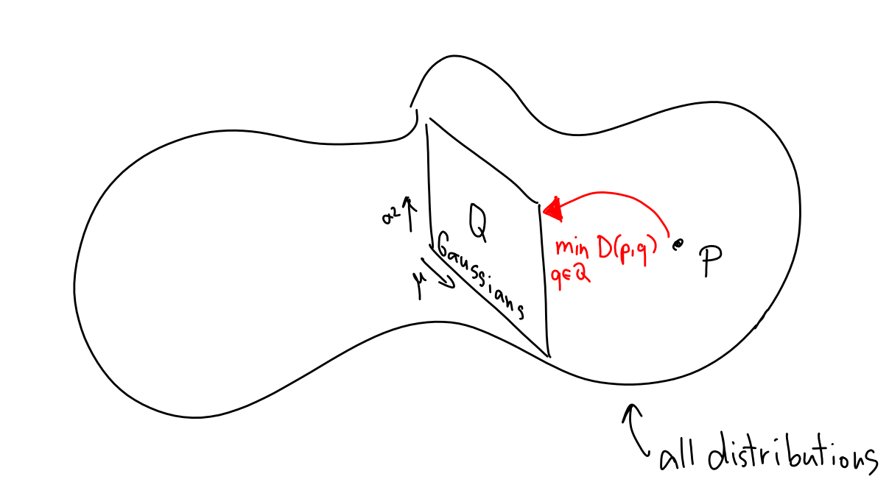
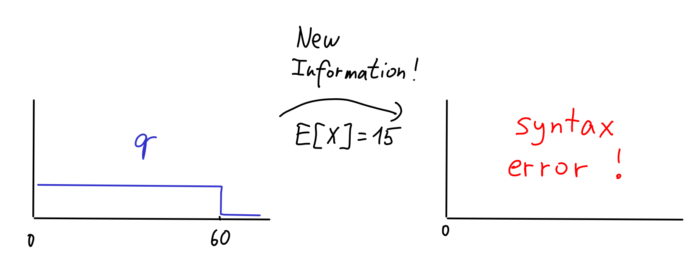
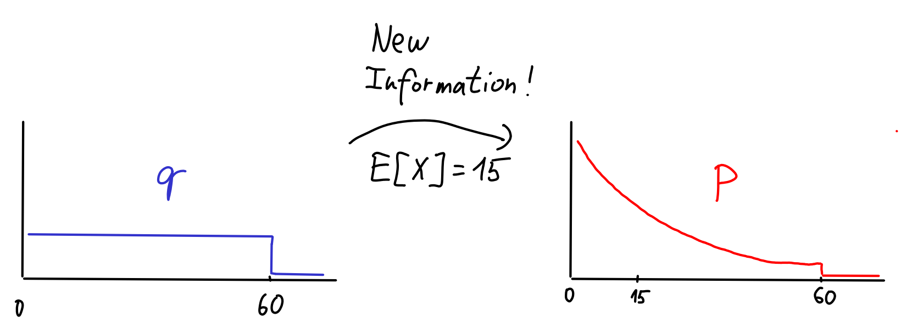
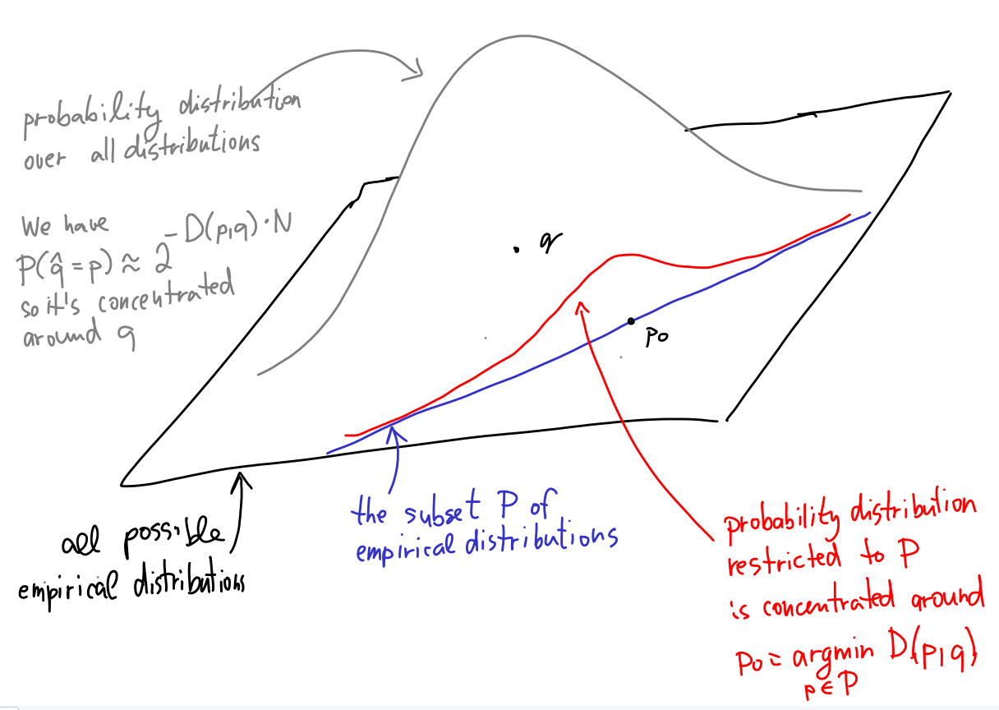

# Minimizing KL divergence 

In this chapter, we'll explore what happens when we minimize the KL divergence between two distributions. Specifically, we'll look at two distinct scenarios:

1.  We begin with a distribution $p$ and aim to find a simpler model for it from a family of distributions $Q$. This can be achieved by minimizing $D(p, q)$ over all $q \in Q$. Special case of this is the _maximum likelihood principle_ (MLE) in statistics.

2.  Alternatively, if we start with a distribution $q$ and learn that the true distribution comes from some family $P$, we find a better model by minimizing $D(p, q)$ over all $p \in P$. Special case of this is _the maximum entropy principle_ in statistics.

Let's dive into the details!

<KeyTakeaway>
Maximum likelihood and maximum entropy principles are about minimizing KL divergence. 
</KeyTakeaway>

## Simplifying models by minimizing KL 

Imagine we have some data—for instance, the 16 foot length measurements $X_1, \dots, X_{16}$ from [our statistics riddle](00-introduction#statistics). Assuming the order of the data doesn't matter, it's convenient to represent these data as an empirical distribution $p$, where each outcome is assigned a probability of $1/16$. This is what we call an _empirical distribution_. In some sense, this empirical distribution is the "best fit" for our data. However, it's a terrible predictive model—it assigns zero probability to outcomes not present in the data! If we were to measure the 17th person's foot, the model is "infinitely surprised" by this. We need something better.

One common approach is to first identify a family of distributions $Q$ that we believe would be a good model for the data. For example, we might suspect that foot lengths follow a Gaussian distribution.<Footnote>Why Gaussians? We'll see soon.</Footnote> In this case, $Q$ would be the set of all Gaussian distributions with varying means and variances. 

Visually, you can think of a "potato" representing all possible distributions, with $p$ as a single point within it. $Q$ would then be a subset, perhaps resembling a half-plane, as it's parameterized by two values: $\mu$ and $\sigma^2$. I like to draw pictures like the one below, though it's of course a dangerous business -- we don't have any kind of [way of measuring distance](https://en.wikipedia.org/wiki/Metric_space) between different distributions. 

Now, let's assume we believe a normal distribution is a suitable model for this data. How do we pinpoint the optimal parameters $\mu$ and $\sigma^2$ to best match the empirical distribution? KL divergence offers a natural solution: Choose $\mu$ and $\sigma$ to minimize $D(p, N(\mu,\sigma^2))$<Footnote> $N(\mu, \sigma^2)$ denotes the Gaussian with mean $\mu$ and variance $\sigma^2$. </Footnote>. More broadly, if we have a collection of candidate distributions $Q$ (like all Gaussians), we select the $q\in Q$ that minimizes $D(p,q)$.

<Math displayMode={true} math = "q_{new} = \argmin_{q\in Q} D(p, q)" />

Why does this make sense? Recall that KL divergence is designed to measure how well a model $q$ approximates the true distribution $p$. More specifically, it is the rate of how quickly a Bayesian detective learns that the true distribution is $p$, not $q$. So, minimizing KL simply means selecting the best "imposter" that it takes the longest to separate from the truth. That's pretty reasonable!

### Maximum likelihood principle 

Let's examine our approach of minimizing $D(p, q)$ more closely. We'll focus on the most common scenario where $p$ is an empirical distribution derived from data points $X_1, \dots, X_n$. To keep the notation tidy, let's assume all $X_i$ are distinct, which means that $p$ is uniform distribution<Footnote>In the general case, $p$ is not necessarily uniform and the probability of each value $x$ is proportional to the count of $x$ in the data. The general case does not change much in the argument we are about to make. </Footnote>. In this situation, we can express the KL divergence we're minimizing as:

<Math displayMode={true} math="D(p,q) = \sum_{X_i\in\mathcal{X}} \frac{1}{n}\log\frac{1/n}{q(X_i)}. " />

Splitting this into entropy and cross-entropy terms:

<Math displayMode={true} math="D(p,q) = \sum_{X_i\in\mathcal{X}} \frac{1}{n}\log\frac{1}{q(X_i)} - \sum_{X_i\in\mathcal{X}} \frac{1}{n}\log\frac{1}{n}. " />

Notice that the entropy term (the second sum) remains constant with respect to $q$. <Footnote> In this specific case, where $p$ is a uniform distribution, we even have $\sum \frac{1}{n}\log n = \log n$, but the key point is that it's a constant independent of $q$. </Footnote> Therefore, minimizing KL divergence is equivalent to minimizing the cross-entropy:

<Math displayMode={true} math="\argmin_{q\in Q} D(p, q) = \argmin_{q \in Q} \sum_{X_i\in\mathcal{X}} \frac{1}{n}\log\frac{1}{q(X_i)}" />

Here, $q(X_i)$ represents the probability (or probability density) that the model assigns to the data point $X_i$. If we drop the constant factor $1/n$ and use the identity $\log(1/x)=-\log x$, this minimization becomes equivalent to maximizing the following product:

<Math displayMode={true} math="\argmin_{q\in Q} D(p, q) =  \argmax_{q \in Q} \prod_{X_i} q(X_i)" />

The right-hand side expression has a very clear interpretation: it's the conditional probability of observing the data $X_i$, assuming they were sampled independently from the model distribution $q$. This type of conditional probability is also known as the "likelihood of $X$ under $q$".

So, what's the big takeaway? Minimizing KL divergence for empirical distributions is equivalent to maximizing the likelihood of the data under the model $q$. The latter is actually a very common technique in statistics, known as the maximum likelihood estimation (MLE) principle. We've just derived it from the perspective of KL divergence!

<Expand headline = "Example: Maximum likelihood for Normal Distribution">

Suppose we are given data $X_1, \dots, X_N$ (which we represent by its empirical distribution $p$) and want to find the best-fitting Gaussian $N(\mu, \sigma^2)$. How should we choose $\hat\mu$ and $\hat\sigma^2$?

The Maximum Likelihood Principle suggests that we should maximize the likelihood, or, more conveniently, maximize the log-likelihood (which is equivalent to minimizing the cross-entropy):

<Math displayMode={true} math="\hat\mu, \hat\sigma^2 = \argmax_{\mu, \sigma^2} \sum_{i = 1}^N \log\left( \frac{1}{2\pi\sigma^2} e^{-\frac{(X_i-\mu)^2}{2\sigma^2}} \right) 
= \argmin_{\mu, \sigma^2} 2N \cdot \log \sigma + \sum_{i = 1}^N \frac{(X_i-\mu)^2}{2\sigma^2}"/>

There are several ways to solve this optimization problem. Differentiation is likely the cleanest: If we define $\mathcal{L}$ to be the expression above, then:
<Math displayMode={true} math = "\frac{\partial \mathcal{L}}{\partial \mu} = \frac{1}{\sigma^2} \sum_{i = 1}^N 2(X_i - \mu) "/>

Setting <Math displayMode={false} math="\frac{\partial \mathcal{L}}{\partial \mu} = 0"/> leads to $\hat\mu = \frac{1}{N} \sum_{i = 1}^N X_i$.

Similarly,
<Math displayMode={true} math="\frac{\partial \mathcal{L}}{\partial \sigma} = 2N/\sigma -2  \sum_{i = 1}^N \frac{(X_i-\mu)^2}{\sigma^3}"/>

Setting <Math displayMode={false} math="\frac{\partial \mathcal{L}}{\partial \sigma} = 0"/> then leads to <Math displayMode={false} math="\hat\sigma^2 = \frac{1}{N} \sum_{i = 1}^N (X_i - \mu)^2. "/>
</Expand>

## Conditioning on steroids 

So, minimizing <Math math="\min_{q \in Q} D(p,q)" /> is quite useful. But what about the other direction, <Math math="\min_{p \in P} D(p,q)" />? This is also extremely valuable, so let's explore an example of what it stands for.

Suppose I want to determine a probability distribution modelling the random variable $X$ of how long it takes me to eat lunch. My initial (and very crude) model of $X$ might be a uniform distribution $q$ between <Math math="0" /> and <Math math="60" /> minutes.

Starting with this model, I can try to get some new information and condition on it to get a better model $p$. 

For example, let's say that after eating many lunches, I observe that I always finish after at most 30 minutes. I can turn this to a new information that $X \le 30$. I can condition on this information and get a better model:

Let's try again. I eat many more lunches, but this time I keep recording the average time it takes me to eat lunch. Say, it turns out to be 15 minutes. How do I change $q$ to reflect this new information? The probability theory gives a clear answer.

We simply can't do this. In probability theory, we can condition on events like $X \le 30$, i.e., facts that are true for some values $X$ can attend but not others. But now we would like to condition on $E[X] = 15$ which is not an event, just a fact that's true for some _distributions_ over $X$. 

The fun part is that we can use KL divergence to 'condition' on $E[X] = 15$. I propose that the correct way to account for the new information is to choose <Math math = "p_{\textrm{new}}" /> as the model minimizing KL divergence to $q$. That is, for the set $P$ of distributions $p$ with $E_p[X] = 15$, choose
<Math id="min-relative-entropy" displayMode={true} math = "p_{\textrm{new}} = \argmin_{p\in P} D(p, q)" />

This is sometimes called [the minimum relative entropy principle](resources#intermediate-resources). Why does this make sense? Intuitively, I want to find a distribution <Math math="p \in P" /> such that <Math math="q" /> remains as good a model of it as possible. This is precisely what we achieve by minimizing KL divergence.

Admittedly, this intuition feels a bit shakey, as we typically prefer $p$ to represent the "true" distribution when using KL divergence, whereas here it's simply a new, improved, model. Fortunately, it is possible to justify the minimum relative entropy principle directly from Bayes' rule. Choosing <Math math="p_{\textrm{new}}" /> by <EqRef id="min-relative-entropy" /> turns out to be equivalent to "updating a model $q$ to incorporate new evidence that the model should be from $P$, using Bayes' rule." This is called [Wallis derivation](https://en.wikipedia.org/wiki/Principle_of_maximum_entropy#The_Wallis_derivation). 

<Expand headline="Detailed discussion of Wallis derivaiton" advanced={true}>
The following argument is a version of the so-called [Wallis derivation](https://en.wikipedia.org/wiki/Principle_of_maximum_entropy#The_Wallis_derivation). 
We will reformulate our setup slighlty to sidestep the "syntax-error" issue and to be able to condition on facts of the type "our model distribution should come from the set $P$". 

Imagine we start with some distribution $q$ and sample from it $N$ times. We'll use $\hat{q}$ to denote the empirical distribution of these samples. The Wallis trick is to realize that $\hat{q}$ is no longer a simple distribution, it's a distribution over distribution (also called a mixture distribution). For $\hat{q}$, it now makes sense to ask questions such as whether $\hat{q}$ belongs to some family of distributions $P$ (e.g., all distributions with an average of 15). 

Our plan is to imagine a very large $N$ and the process of generating $\hat{q}$ from $q$. We then condition the distribution of $\hat{q}$ on the fact that $\hat{q} \in P$ to obtain the posterior distribution. We will argue the following claim: _As $N$ approaches infinity, the posterior distribution will become concentrated on the distribution $p \in P$ that minimizes $D(p,q)$_. This provides the justification for the minimum relative entropy principle. The methodology is essentially equivalent to saying "If I keep my model $q$, but inexplicably, the data actually is from a set $P$, then I can as well model the data by <Math math = "\argmin_{p \in P} D(p,q) " />. 

Let's prove the claim.

First, a bit of notation: Think of $\hat{q}$ as a [random vector](https://en.wikipedia.org/wiki/Multivariate_random_variable) whose randomness stems from the choice of the $N$ samples from $q$. Let $P_0$ be the space of all random vectors <Footnote>More precisely, $P_0$ should be chosen as the space of all distributions where probabilities are multiples of $1/N$, but let's not get bogged down in technicalities.</Footnote> - we are given its subset $P$ from which the new model shall be picked. Here's a picture:

We now need to understand the distribution of $\hat{q}$, i.e., we want to understand the probability $P(\hat{q} = p)$ for $p \in P_0$. There are two ways to do this.

1.  We can write it down exactly (<Math math="P(\hat{q} = p) = {N \choose p_1N, \dots, p_kN}\cdot \prod_{i = 1}^k q_i ^ {p_i N}" />) and solve it (using Stirling's approximation, we have <Math math="P(\hat{q} = p) \approx 2^{H(p)\cdot N}" /> and thus <Math math="P(\hat{q} = p) \approx 2^{-D(p,q)\cdot N}" />).

2.  If you prefer to see the underlying algebra, we can revisit the [first chapter](01-kl_intro#expected-distinguishing-evidence) where our Bayesian friend was essentially trying to compute the probability we now need. More concretely, if our friend obtained $N$ samples and the empirical distribution was $p$, all the evidence supporting a hypothesis $q$ summed up to the value $N \cdot H(p, q)$. The meaning of this evidence is that the probability <Math math="P(\hat{q} = p)" /> must be proportional to <Math math="2^{-N \cdot H(p, q)}" />; we just don't know the normalization constant.

Now, with a bit of hand-waving, we can observe that the probability distribution of <Math math="\hat{q}" /> will be concentrated around the value of $q$ as $N$ approaches infinity, even though there's a nonzero probability that $\hat{q} \in P$. If that happens, we similarly find that the posterior distribution is concentrated around the value <Math math="\tilde{p} = \argmin_{p \in P} D(p,q)"/>. We conclude that in the limit of $N$ going to infinity, working with mixture distributions and conditioning on it being from $P$ is equivalent to simply replacing $q$ with <Math math="\argmin_{p \in P} D(p,q)"/>.

As a final note (unrelated to Wallis derivation), to justify the inuition that minimum relative entropy principle extends conditioning, we have to check carefully that conditioning is really a special case of minimizing KL. The fact that you have to prove (and it's a good exercise!) is this: If you have a joint distribution $p$ over two random variables $X,Y$ and learn that $Y = y$, there are two things you could do. 1) Define distribution $p_1$ by conditioning $p$ on $Y = y$. 2) Define distribution $p_2$ as <Math math = "\argmin_{p'} D(p', p)$." />. You should prove that $p_1 = p_2$. 

</Expand>

{/*
<Expand headline = "Min relative entropy implies Bayes' updating" advanced={true}>
One more technical point. We should confirm that we can view classical updating as a special case of the min relative entropy principle. This justifies the intuition that minimum relative principle is "conditioning on steroids". 

Consider the general problem of updating after seeing evidence: We have a joint distribution <Math math = "p_{old}" /> over two random variables $X$ (which we're interested in) and $Y$ (representing possible evidence we might observe).
Then, we observe some evidence $Y=y$. We want to compute the new distribution <Math math = "p_{new}" /> that incorporates this observation. The rules of conditional probability say that <Math math = "p_{new}" /> should be $0$ for $Y \not= y$ and, for $Y = y$, it should be the conditional distribution of $p$ given $Y = y$.

The observation we can now make is that <Math math="p_{new} = \argmin_{p \in P} D(p, p_{old})" />, where $P$ is the set of distributions where $P(Y = y') = 0$ for $y' \ne y$<Footnote>The proof of this observation requires some rewriting, but in essence, it hinges on the fact that the distribution closest in KL to $p$ conditioned on $Y = y$ is... the same distribution. Really, nothing complicated is happening here; we are just saying that the new distribution should resemble the old one, merely rescaled so that probabilities sum to one.</Footnote>.
</Expand>
*/}

### The maximum entropy principle 

Let's delve deeper into the minimum relative entropy principle. A conceptual issue with it is that it only allows us to refine an existing model $q$ into a better model $p$. But how did we choose the initial model $q$ in the first place? It feels a bit like a chicken-and-egg dilemma.

Fortunately, there's usually a very natural choice for the simplest possible model $q$: the uniform distribution. This is the unique distribution that assigns the same probability to every possible outcome. In a sense, it's the most "even" distribution we can possibly have. This argument for the uniform distribution is known as the [principle of indifference](https://en.wikipedia.org/wiki/Principle_of_indifference).

So, it would be highly interesting to understand what happens when we start with the uniform distribution $q$ (say, over a discrete set $\{1, \dots, k\}$) and find a better model <Math math = "p_{new} \in P" /> by minimizing KL divergence. Let's write it out:

<Math displayMode={true} math="p_{new} = \argmin_{p \in P} D(p,q_{\textrm{uniform}}) = \sum_{i = 1}^k p_i \log \frac{p_i}{ 1/k}" />

After splitting the KL divergence into entropy and cross-entropy, we can rewrite this as:

<Math displayMode={true} math="D(p,q_\text{uniform}) = \sum_{i = 1}^k p_i\log p_i - \sum_i p_i\log (1/k)" />

Since the second term is a constant (specifically, equal to $-\log (1/k) = \log(k)$), minimizing KL divergence is equivalent to maximizing the negative of the first term, which is simply the entropy of $p$:

<Math displayMode={true} math="p_{new} = \argmin_{p \in P} D(p, q_{\textrm{uniform}}) = \argmax_{p\in P} H(p)" />

We've just derived what's known as the [maximum entropy principle](https://en.wikipedia.org/wiki/Principle_of_maximum_entropy): given a set $P$ of distributions to choose from, we should opt for the $p\in P$ that maximizes its entropy $H(p)$.

<Expand advanced={true} headline = "Working with Continuous Distributions">

Sometimes we need to use entropy and KL divergence for continuous distributions. For KL divergence, not much changes. We just replace the sum with an integral and write:
<Math displayMode={true} math = "D(p, q) = \int_x p(x) \log \frac{p(x)}{q(x)} dx. " />

For entropy, it's a bit trickier. To understand what's happening, let's remember what an integral intuitively represents. For example, a continuous uniform distribution over the interval $[0,1]$ is, in some sense, a limit of discrete distributions, where the $n$-th distribution in the sequence is the uniform distribution over <Math math = "\{\frac{1}{n}, \dots, \frac{n}{n}\}"/>. 

When we use integral formulas like the one above for KL divergence, it's justified by _convergence_: If we discretize the real line into buckets of length $1/n$ and compute KL divergence, then as $n$ increases, the discretized results will converge to the integral's value (unless $p,q$ are some wild functions).

The problem with entropy is that it doesn't converge. Indeed, the entropy of a uniform distribution with $n$ options is $\log n$. If $n$ goes to infinity, $\log n$ goes as well, hence the entropy of a continuous uniform distribution is infinite. This makes sense! If I sample a real number from [0,1], there is infinite surprise in what I see. I also can't store the number on my disk since there are infinitely many bits to store.

What does this mean for the principle of maximum entropy? If this principle was purely about entropy, we'd be in trouble. But, thankfully, we now understand that it is fundamentally about _minimizing KL divergence_ between $p$ and a model distribution, which, in the case of the max entropy principle, is the uniform distribution.

So, let's write down the formula for KL between $p$ and the uniform distribution. Since the uniform distribution does not exist for real numbers, let's use the interval $[-C, C]$ as the support; $C$ is some large number. We get: 
<Math displayMode={true} math = "D(p, q_{uniform}) = \int p(x) \log \frac{p(x)}{1/(2C)} dx = \log (2C) + \int p(x) \log p(x) dx." />
That is, in the continuous case, the minimum relative entropy principle boils down to maximizing the expression $\int p(x) \log \frac{1}{p(x)} dx$. This holds for any constant $C$, so we might as well use the principle also in the limit when $x$ ranges over all real numbers. 

So, after all this discussion, generalizing the minimum relative entropy trick to continuous distributions still boils down to replacing $\sum$ with $\int$ and maximizing $\int p(x) \log \frac{1}{p(x)} dx$. This integral expression is called [differential entropy](https://en.wikipedia.org/wiki/Differential_entropy) so it looks like it's basically the same thing as our entropy formula for discrete distributions. In the main text, I am also calling this expression implicitly "the entropy" so as not to scare normies.

On the first glance, that does not seem to be too big of an imprecision. In fact, when Shannon - the information theory [GOAT](https://www.dictionary.com/e/slang/g-o-a-t/) - defined entropy in his landmark paper, he just mentioned in passing something like "and to generalize entropy to continuous distributions, just replace sum by integral". 

It took some time before people got to know better and realized that this is all a bit more subtle than what it looks like and the fact that we can use differential entropy is a bit of a lucky coincidence. The key to not get confused is to understand that it is the _relative entropy_, i.e., KL divergence that generalizes to continuous distributions. Entropy is infinite. Thus, we can replace entropy with differential entropy in our maximum entropy principle _only because the argument is ultimately about KL divergence to the uniform distribution_!    
</Expand>

<Expand headline = "Example: Gaussian Distribution">
Here's an example of how the maximum entropy principle can be applied. Let's say we want to model some real-valued data that is known to have a certain mean $E_p[X] = \mu$ and variance $E_p[(X-\mu)^2] = \sigma^2$.
If we want to select a distribution that models this data in the absence of any other information, the maximum entropy principle suggests we should define the set $P$ as all distributions with mean $\mu$ and variance $\sigma^2$, and then choose the maximum entropy distribution $p$ from this set $P$.

As we'll discuss [later](05-machine_learning), this particular distribution $p$ turns out to be the Gaussian with mean $\mu$ and variance $\sigma^2$. So, the maximum entropy principle tells us that, without additional evidence, we should model such data as Gaussian, assuming the given mean and variance.

It's often helpful to think about this principle more abstractly. Imagine we don't even know the precise values of $\mu$ and $\sigma^2$; we just believe that the mean and variance are important parameters. In this scenario, the maximum entropy principle informs us that we should model the data using *some* Gaussian distribution. In other words, we conclude that the family of Gaussians is the *appropriate* family to represent numerical data when our primary concerns are their mean and variance. This is a very powerful insight!

{/*
So, we can think of the philosophy of updating via Bayes' theorem as a special case of the philosophy of minimizing KL divergence. This is all very circular and a bit fuzzy, but the key takeaway is that minimizing KL can be thought of as extension of Bayes' philosophy.

### A few more observations 

We will spend the whole next chapter discussing all the applications of the maximum entropy principle, but let's already make two observations about it. Those observations correspond to two important properties of entropy.

1. For discrete distributions over $\{1, \dots, k\}$, the distribution that maximizes the entropy is the uniform distribution<Footnote>See e.g. [this](https://stats.stackexchange.com/questions/66108/why-is-entropy-maximised-when-the-probability-distribution-is-uniform)</Footnote>. Its entropy is $\log_2 k$. The implication of this for the max-entropy principle is that if our set $P$ of allowed distributions contains the uniform distribution, then max-entropy principle chooses it. That is, maximum entropy principle is just an extension of the principle of indifference.

2. If you have a joint distribution $(p,q)$, then $H((p,q)) \le H(p) + H(q)$, with equality if and only if $p$ and $q$ are independent.
<Footnote>
This is called [subadditivity of entropy](01-kl_intro#information-theory). Why is it subadditive? If you still remember [our discussion of mutual information](01-kl_intro#information-theory), the mutual information is defined as $D((p,q), p \otimes q)$. You can rewrite this expression as $H(p) + H(q) - H((p,q))$ (try it!), so subadditivity of entropy is equivalent to mutual information being nonnegative.
</Footnote>
The implication for the max-entropy principle is this: Imagine that you work with a joint distribution and you know its two marginals $p,q$. Then, the maximum entropy principle tells us that the joint distribution with these two marginals that maximizes the entropy is the one where they are independent.
Whenever people model stuff by probability distributions, they assume that two distributions are independent all the time. We can think of this assumption as a special case of the maximum entropy principle.
*/}
</Expand>

## Next Steps 

In the [next chapter](04-max_entropy), we'll explore more concrete modeling applications of the max entropy principle. We'll see how they apply to various fields like machine learning, statistical modeling, and elsewhere. 