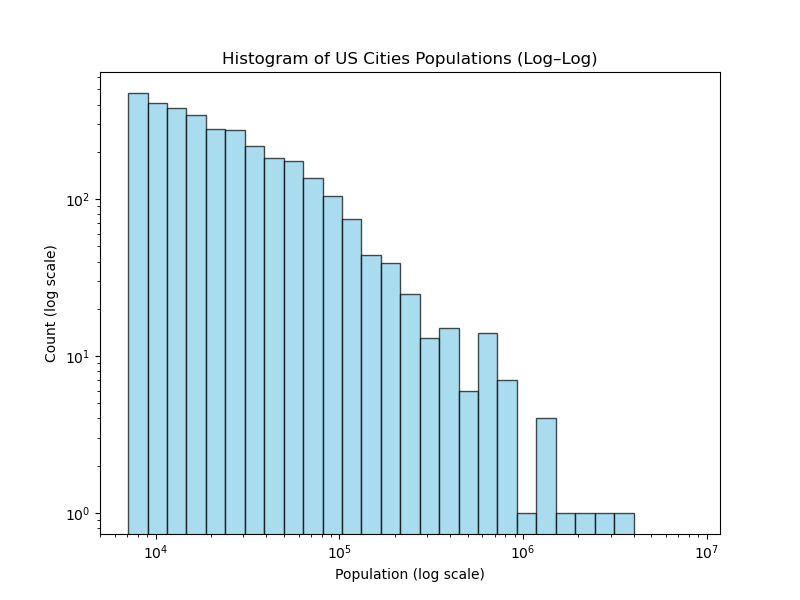

# Max entropy distributions 

In the [previous chapter](03-minimizing), we saw how minimizing KL divergence generalizes two vital statistical concepts: **maximum likelihood** and **maximum entropy**.

Let's now dive a bit deeper into maximum entropy. Specifically, we'll try to understand what maximum entropy distributions actually look like. For such a broad question, the answer turns out to be surprisingly straightforward!

## General form of maximum entropy distributions

The core question we want to address is this: If we limit ourselves to a set of distributions $P$ that possess specific properties, what is the form of the maximum entropy distribution within that set?

Let's start with a couple of examples. If we consider distributions with a fixed expectation $E[X] = \mu$ (and the domain is non-negative real numbers), the maximum entropy distribution is the **exponential distribution**. This distribution has the form <Math math = "p(x) \propto e^{-\lambda x}" />. Here, $\lambda$ is a parameter—different values of $E[X]$ lead to different $\lambda$s. <Footnote>In this particular case, the precise shape of the distribution is <Math math = "p(x) = \frac{1}{\mu} e^{- x/\mu}" />, but let's not worry too much about constants for now.</Footnote>

Another example: If we fix both $E[X]$ and $E[X^2]$ to certain values, the maximum entropy distribution is the **normal distribution**, where <Math math = "p(x) = \frac{1}{\sqrt{2\pi\sigma^2}} e^{-(x-\mu)^2/(2\sigma^2)}." /> To keep things clean, we can rewrite its shape as <Math math = "p(x) \propto e^{-\lambda_1 x - \lambda_2 x^2}." /> for some constants $\lambda_1, \lambda_2$.

Spot a pattern?

<Block headline= "General form of max entropy distributions">
Here's the general form of maximum entropy distributions: Suppose we have a set of constraints $E[f_1(X)] = \alpha_1, \dots, E[f_m(X)] = \alpha_m$. Then, among all distributions that satisfy these constraints, the distribution $p$ with maximum entropy has the following shape:
<Math id="max-entropy-form" displayMode = {true} math = "p(x) \propto e^{\lambda_1 f_1(X) + \dots + \lambda_m f_m(X)}"/>
for some constants $\lambda_1, \dots, \lambda_m$.
</Block>
Notice that this general recipe doesn't tell us the exact values of $\lambda_1, \dots, \lambda_m$. Those depend on the specific values of $\alpha_1, \dots, \alpha_m$ (though the general shape remains the same regardless of the $\alpha$ values). But don't get too hung up on the $\alpha$s and $\lambda$s. The key takeaway is that the maximum entropy distribution looks like an exponential, with the "stuff we care about"—the functions $f_1, \dots, f_m$—in the exponent.

Try building your own maximum entropy distribution by setting constraints:

<DistributionConstraintBuilder />

### Why? 

Let's build some intuition for this. Remember from [the previous chapter](03-minimizing) that the max-entropy principle is essentially about finding a distribution that is as close to uniform as possible, in the sense of minimizing KL divergence.

So, in what way are max-entropy distributions "close" to being uniform? Let's use the exponential distribution $p(x) \propto e^{-x}$ as an example. Say I independently sample two numbers from it, $x_1$ and $x_2$. Here's a little riddle: Is it more probable that I sample $x_1 = 10, x_2 = 20$ or that I sample $x_1' = 15, x_2' = 15$?

The answer is that both options have the same probability. That's because $p(x_1)\cdot p(x_2) = e^{-x_1 - x_2}$. In our riddle, $x_1 + x_2 = x_1' + x_2'$, so both possibilities have a density proportional to $e^{-30}$. In other words, on the density graph below, points on the black line with the same sum $x_1 + x_2 = 0.7$ have identical density. Stated differently, the conditional distribution *on that line* is uniform.

This isn't exclusive to the exponential distribution; it holds for all max-entropy distributions that fit the form given by our formula <EqRef id="max-entropy-form" />. In general, consider a distribution of the shape <Math math = "p(x) \propto e^{\lambda_1 f_1(x) + \dots + \lambda_m f_m(x)}" />. Now, imagine independently sampling a few points $x_1, \dots, x_k$ from that distribution. If you then tell me the values of the averages $a_1 = \frac{1}{k} \sum_{i = 1}^k f_1(x_i), \dots, a_m = \frac{1}{k} \sum_{i = 1}^k f_m(x_i)$, and I condition on this information, the conditional distribution over $x_1, \dots, x_k$ is actually **uniform**! This is because the occurrence probability of any such tuple under our distribution $p$ is the same, equal to <Math math = "p(x_1, \dots, x_k) \propto e^{k(\lambda_1 a_1 + \dots + \lambda_m a_m)}" />. 

You can imagine this as a generalization of the picture above. There's a super complicated space of all possible outcomes I can get by sampling $N$ times from my distribution. The max-entropy property says that if I draw a "contour" through outcomes that share the same empirical averages of the functions $f_1, \dots, f_m$, the conditional distribution is uniform on this contour. 

So, what's the takeaway? When you sample from max-entropy distributions, the experience is actually quite similar to sampling from a uniform distribution! <Footnote>If we think of the number $n$ of samples as being very large, it gets even better. Due to the law of large numbers, we then know that with high probability, the empirical averages $\frac{1}{n} \sum_{i = 1}^n f_j(x_i)$ are going to be close to $E[f_j(X)]$. So, sampling many samples from max-entropy distributions is like sampling from the uniform distribution over all the instances that satisfy constraints $\frac{1}{n} \sum_{i = 1}^n f_j(x_i) \approx E[f_j(X)]$ that we imposed at the distribution. </Footnote>

There's also an elegant derivation of the shape of max-entropy distributions using Lagrange multipliers. Feel free to skip this if you're not familiar with how they work.

<Expand headline = "Derivation by Lagrange Multipliers">
We'll only consider discrete distributions, say those with support $\{1, \dots, K\}$. This is an optimization problem for $K$ variables $p_1, \dots, p_K$:

<Math displayMode={true} math = "\begin{aligned}
\text{VARIABLES:} &\quad p_1, \dots, p_K \\
\text{MAXIMIZE:} &\quad \sum_{i = 1}^K p_i \log \frac{1}{p_i}\\
\text{CONSTRAINTS:} & \quad \sum_{i = 1}^K p_i \cdot f_1(i) = \alpha_1\\
&\quad \vdots \\
&\quad \sum_{i = 1}^K p_i \cdot f_m(i) = \alpha_m\\
&\quad \sum_{i = 1}^K p_i = 1
\end{aligned}"/>

If there were no constraints, the problem would be simple! We'd just take the expression to maximize (the entropy) and set all partial derivatives with respect to $p_1, \dots, p_K$ to zero.

Fortunately, a technique called [Lagrange multipliers](https://en.wikipedia.org/wiki/Lagrange_multiplier) helps us here. It involves turning _hard_ constraints (like those in our problem) into _soft_ constraints. A soft-constraint version of our problem would be:

<Math displayMode={true} math = "\begin{aligned}
\text{VARIABLES:} &\quad p_1, \dots, p_K\\
\text{MAXIMIZE:} &\quad \sum_{i = 1}^K p_i \log \frac{1}{p_i}\\
&\quad - \lambda_1 \left(\sum_{i = 1}^K p_i \cdot f_1(i) - \alpha_1\right)\\
&\quad - \lambda_2 \left(\sum_{i = 1}^K p_i \cdot f_2(i) - \alpha_2\right)\\
&\quad - \dots \\
&\quad - \lambda_m \left(\sum_{i = 1}^K p_i \cdot f_m(i) - \alpha_m\right)\\
&\quad - \lambda_{m+1} \left(\sum_{i = 1}^K p_i - 1\right)
\end{aligned}"/>

What happens is that instead of requiring the solution to *exactly* satisfy all the constraints, we just say that we have to pay an additional cost for deviating from the target. The constants $\lambda_1, \dots, \lambda_{m+1}$ essentially tell us how important each constraint is—a large $\lambda_j > 0$ means that $\sum_{i = 1}^K p_i \cdot f_j(i) - \alpha_j$ had better be small! <Footnote>In fact, in this soft constraint formulation, we even get "paid" if <Math math = "\lambda_j \left( \sum_{i = 1}^K p_i \cdot f_j(i) - \alpha_j \right) < 0" />! </Footnote>

Long story short, Lagrange's method tells us that if someone provides a solution to our problem satisfying all $m+1$ _hard_ constraints, then we can find $m+1$ numbers $\lambda_1, \dots, \lambda_{m+1}$ such that this solution also solves the soft-constrained version. That's neat! We can now implement our plan of solving this by differentiation.

More precisely, let's use $\mathcal{L}$ for the soft-constrained objective:
$$
\mathcal{L}(p_1, \dots, p_K) = \sum_{i = 1}^K p_i \log \frac{1}{p_i}
- \lambda_1 \left(\sum_{i = 1}^K p_i \cdot f_1(i) - \alpha_1\right)
- \dots -
- \lambda_m \left(\sum_{i = 1}^K p_i \cdot f_m(i) - \alpha_m\right)
- \lambda_{m+1} \left(\sum_{i = 1}^K p_i - 1\right)
$$

We compute the derivative with respect to some $p_i$. Using the fact that $(p \log 1/p)' = -(p\log p)' = -\log p - 1$, we find that:

<Math displayMode={true} math = "\frac{\partial \mathcal L}{\partial p_i} = -\log p_i - 1 - \lambda_1 f_1(i) - \dots - \lambda_m f_m(i) - \lambda_{m+1}"/>

That's fantastic! If we now set <Math math = "\frac{\partial \mathcal L}{\partial p_i} = 0"/>, we get a formula for $p_i$:
<Math displayMode={true} math = "p_i = e^{ -1 - \lambda_1 f_1(i) - \dots - \lambda_m f_m(i) - \lambda_{m+1}}"/>
I find it more helpful to rewrite this as:
<Math displayMode={true} math = "p_i \propto e^{ - \lambda_1 f_1(i) - \dots - \lambda_m f_m(i)}"/>

I've just swept some proportionality constants under the rug: if we remember that probabilities have to sum up to 1, we've arrived at a shockingly simple formula!

We could, of course, generalize this formula to other discrete sets beyond $\{1, \dots, K\}$, yielding:

<Math displayMode={true} math = "p(x) \propto e^{ - \lambda_1 f_1(x) - \dots - \lambda_m f_m(x)}"/>

This is the general form of max-entropy distributions (except we formulated it with $+\lambda_j$ instead of $-\lambda_j$). 

The same formula also holds when the probability distribution is continuous, except that $p(x)$ is then technically a probability density. Also, the correct buzzword is no longer Lagrange multipliers, but its generalization called [calculus of variations](https://en.wikipedia.org/wiki/Calculus_of_variations). <Footnote>You also have to spend a few more years trying to understand the conditions under which it can be used. Even the Lagrange multiplier case is more tricky—for example, we've only found local extrema and saddle points, not necessarily the maximizer. In our case, we are fortunate that we minimize convex function over convex domain, where the local minimum is also the global minimum. </Footnote>

Now, this formula isn't the complete solution to our problem because it involves some magical constants $\lambda_1, \dots, \lambda_m$ that we don't know. To find their values, we have to go back to our constraints—remember those $m$ numbers $\alpha_1, \dots, \alpha_m$? We can use the conditions $E[f_j(x)] = \alpha_j$ to work out the precise shape of the distribution.
</Expand>

---

We'll be working a lot with continuous distributions. This leads to some technical issues that we discuss in the next Expand box.

<Expand headline = "Working with Continuous Distributions">

Sometimes we need to use entropy and KL divergence for continuous distributions. For KL divergence, not much changes. We just replace the sum with an integral and write:
<Math displayMode={true} math = "D(p, q) = \int_x p(x) \log \frac{p(x)}{q(x)} dx. " />

For entropy, it's a bit trickier. To understand what's happening, let's remember what an integral intuitively represents. For example, a continuous uniform distribution over the interval $[0,1]$ is, in some sense, a limit of discrete distributions, where the $n$-th distribution in the sequence is the uniform distribution over <Math math = "\{\frac{1}{n}, \dots, \frac{n}{n}\}"/>. When we use integral formulas like the one above for KL divergence, it's justified by _convergence_: If we discretize the real line into buckets of length $1/n$ and compute KL divergence, then as $n$ increases, the discretized results will converge to the integral's value (unless $p,q$ are some wild functions).

The problem with entropy is that it doesn't converge. Indeed, the entropy of a uniform distribution with $n$ options is $\log n$, so the entropy of a continuous uniform distribution is infinite. This makes sense! If I sample a real number from [0,1], I can't store it on my disk since there are infinitely many bits of information to store.

Fortunately, it *still* makes sense to talk about KL divergence of continuous random variables—since this is the _relative_ entropy between two distributions, the infinities "cancel out," and as we discussed, we get convergence and sensible numbers.

What does this mean for the principle of maximum entropy? If this principle were purely about entropy, we'd be in trouble. But, thankfully, we understand from [the previous chapter](03-minimizing) that this principle is fundamentally about minimizing KL divergence between $p$ and a model distribution, which, in the case of the max entropy principle, is the uniform distribution.

If we write out the formula for KL between $p$ and a uniform distribution<Footnote>Let's assume we integrate over the interval $[0,1]$ so that it's well-defined.</Footnote>, we get <Math math = "D(p, q_{uniform}) = \int p(x) \log \frac{p(x)}{1} dx = \int p(x) \log p(x) dx" />. That is, in the continuous case, the maximum entropy principle tells us to maximize the expression $\int p(x) \log \frac{1}{p(x)} dx$, which is called **differential entropy**.

So, after all this discussion, generalizing our technique to continuous distributions still boils down to replacing $\sum$ with $\int$. This makes it a bit hard to appreciate that actually, a lot of stuff's happening under the hood. In particular, the reason everything works out is that ultimately, our argument is about _relative_ entropy and the differential entropy only makes sense in the context of _relative entropy_ (KL divergence), not entropy itself which is infinite. 
</Expand>

---

## Catalogue of examples

Let's go through the list of maximum-entropy distributions you might have encountered. In fact, most distributions used in practice are maximum entropy distributions for some specific choice of functions $f_1, \dots f_m$.

So, when you come across a distribution, the right question isn't really "Is this a max entropy distribution?" It's more like, "**For what parameters is this a max entropy distribution?**" For example, you can forget the exact formula for the Gaussian distribution—it's enough to remember that using it implies you believe the mean and variance are the most important parameters to consider.

Let's go through the examples with this in mind. 

### No Constraints

In the absence of any constraints, we have $p(x) \propto e^{0}$, which means the max entropy distribution is **uniform**. In other words, the maximum entropy principle is truly an extension of [the principle of indifference](03-minimizing#maximum-entropy-principle) that we discussed in the previous chapter.

One thing to keep in mind is that a uniform distribution doesn't always exist—specifically, there's no uniform distribution over all real numbers.

### Fixing $E[X]$ (Logits)

If we believe the mean is an important parameter of a distribution (as we usually do), the max entropy principle states that the right family of distributions to work with are those with the shape:

<Math displayMode={true} math = "p(x) \propto e^{\lambda x}"/>

This kind of distribution is known by several names, depending on the underlying set over which it's defined. Let's first understand it in the simplest possible case: when our distribution is supported on only two outcomes, $a_1, a_2$. Then, the max-entropy distribution takes the form:

<Math displayMode={true} math = "p(a_1) = \frac{e^{- \lambda a_1}}{e^{- \lambda a_1} + e^{- \lambda a_2}},\;\;\; p(a_2) = \frac{e^{-\lambda a_2}}{e^{- \lambda a_1} + e^{- \lambda a_2}}"/>

But it's actually better to write it like this:

<Math displayMode={true} math = "p(a_1) = \frac{1}{1 + e^{- \lambda (a_1 - a_2)}},\;\;\; p(a_2) = \frac{e^{-\lambda (a_1 - a_2)}}{1 + e^{- \lambda(a_1 - a_2)}}"/>

The function $\sigma(x) = 1/(1 + e^{-x})$ is called the [logistic function](https://en.wikipedia.org/wiki/Logistic_function)<Footnote>Or sometimes a sigmoid function. Apparently, [sigmoid function](https://en.wikipedia.org/wiki/Sigmoid_function) is a bit more general term.</Footnote> and the parameter $x$ is typically called a [logit](https://en.wikipedia.org/wiki/Logit). Using this function, our max-entropy distribution can be written as:

<Math displayMode={true} math = "p(a_1) = \sigma(\lambda (a_1 - a_2)),\;\;\; p(a_2) = 1 - \sigma(\lambda (a_1 - a_2))"/>

Here's my interpretation: if you want to talk about probabilities, but for some reason you prefer to work with general real numbers instead of numbers in $[0,1]$, you should use logits and apply the logistic transformation to convert them to probabilities. 

The parameter $\lambda$ in the formula corresponds to the choice of units in which we measure those logits. For instance, I often prefer to use the binary logarithm, which means measuring logits in bits.

<LogisticWidget 
  title="Sigmoid Function" 
  initialLambda={2}
  minLambda={-5}
  maxLambda={5}
/>

<Block headline = "Logistic Function">
The logistic function $\sigma(x) = 1/(1 + e^{-x})$ is the appropriate function to convert between real numbers (logits) and probabilities.
</Block>

<Expand headline = "Elo System">
The Elo system is used to assign ratings to players. Its fundamental idea is that when you have two players with Elos $E_1$ and $E_2$, you can estimate the probability that the first one wins from their difference $D = E_1 - E_2$. As we just discussed, the softmax function for $E_1, E_2$ is equivalent to mapping $D$ to a probability using the logistic function.

This is precisely how the Elo system was designed; the interpretation of a chess Elo number is that the probability that the first player wins should be <Math math = "\frac{1}{1 + 10^{D / 400}}" />. <Footnote>It's more precisely the expected score of the first player due to the existence of draws.</Footnote> This is the logistic function with $\lambda = \frac{1}{400} \cdot \ln 10$.

Notice that without knowing the value of $\lambda$, the statement "the Elo difference between these two players is 200" is meaningless—we don't know how Elo is scaled. Yet, even without knowing $\lambda$, we understand the system pretty well: if the chance of an upset (i.e., the lower-rated player wins) is $p$ for $D = 200$, then for $D=400$ it's roughly $p^2$, for $D=600$ it's roughly $p^3$, and so on.
</Expand>

<Expand headline = "Probabilities vs. Logits">
When we analyzed the Bayesian hero from the [first chapter](01-kl_intro), it was easier to work with logarithms of odds rather than the odds themselves. Whenever this happens, we can say we're working "in the logit space."

Since in our example there were just two hypotheses, we subtracted the two relevant surprisals and worked with "log-odds." We could also call the log-odds number the logit; these are basically synonyms. As far as I know, when there are more than two hypotheses, people tend to stick with the language of "logits."
</Expand>

<Expand headline="Logistic activation function">
In the early days of deep learning, the logistic function was used as an [activation function](https://en.wikipedia.org/wiki/Activation_function)—it converted aggregated inputs to a neuron's output. We can now provide a probabilistic rationale for this: this way of handling neurons corresponds to modeling them as devices where "each neuron aggregates its inputs and then decides whether to fire or not."

Unfortunately, this function doesn't seem to perform too well in practice. As the field evolved, researchers realized it's better to use the [ReLU](https://en.wikipedia.org/wiki/Rectifier_(neural_networks)) activation function (or [something similar](https://en.wikipedia.org/wiki/Activation_function#Comparison_of_activation_functions)) instead of sigmoids. That activation function corresponds to neurons that not only contemplate *whether* to send any signal or none, but also send out a stronger output signal if they receive strong input.
</Expand>

### Fixing $E[X]$ (Softmax) 

Let's stick with the max-entropy distribution for $E[X]$, but now consider the more general case where our distribution is supported on a set of numbers $\{a_1, \dots, a_k\}$—these distributions are often called [categorical distributions](https://en.wikipedia.org/wiki/Categorical_distribution). In this scenario, the max entropy distribution is what's known as a **softmax** (or softmin) distribution—each number $a_i$ is chosen with probability:

<Math displayMode={true} math = "p_i \propto e^{\lambda a_i}. "/>

You can think of the softmax function (or softmin if $\lambda < 0$) as the generalization of the logistic function we just discussed—it's **the right way** to convert a bunch of numbers into probabilities. The numbers $a_i$ are still often referred to as logits.

The parameter $1/|\lambda|$ is frequently called "temperature" because it behaves that way: at low temperatures, softmax is very orderly and acts much like the `max` function, whereas for high temperatures, the distribution becomes more chaotic, ultimately approaching a uniform distribution. The chaos can be measured by entropy - you can see in the widget below how it decreases if you increase $|\lambda|$. 

<SoftmaxWidget values={[1, 3, 2, 5, 4]} title="Softmax Distribution Example" />

<Expand headline = "Logits in Neural Networks">
Typical neural networks output probabilities. For example, a common neural network classifying images will output an entire probability distribution indicating whether a given picture is a dog/cat/horse/... instead of just a single prediction.
The issue with this is that often, most of these probabilities are extremely small, perhaps on the order of $10^{-10}$. That's because, given a picture of a dog, the neural network is usually quite certain it's not an octopus.

This makes it awkward to work directly with probabilities inside the network—it leads to all sorts of numerical and stability issues while running it (float precision) and even more while training it (vanishing gradients). So, neural networks instead try to predict **logits**, and the conversion to probabilities is simply the final layer of the network.

A nice bonus is that if you train the network using softmax with $\lambda = 1$, you can change the $\lambda$ parameter *after* training. For instance, setting $\lambda$ to infinity (temperature goes to zero) is equivalent to simply choosing the most probable option—this makes the model's output deterministic, which is often useful during deployment.

{/*There are also application for higher temperatures. For example, if you want to use LLM to solve a hard math problem, you might want to run it a million times to increase the probability the net solving it. But then you should probably run it at higher temperatures to make sure you want get the same thought process a million times in a row.

Notice how softmax allowed us to elegantly solve a problem that's so fuzzy that it's otherwise pretty hard to approach -- given a probability distribution $p$, how do we find distributions $p'$ that preserve as much as possible from $p$, yet they are more or less concentrated on the most probable values. */}
</Expand>

<Expand headline = "Modeling Pasta Consumption">

Theoretical economics tries to understand setups like this: Imagine there are $k$ substitutable products competing in the market—perhaps different shapes of pasta. We can observe how well each shape sells, but to draw conclusions from this data, we need some underlying model of what's happening. The basic model of rational consumers assumes each product $i$ has a certain utility $a_i$, and each customer simply buys the product with the highest utility. The problem with this model is that it predicts people should consistently buy only a single product—the one with the largest $a_i$.

How should we adapt this model to allow for non-trivial probability distributions? Well, we've seen that the natural "soft" generalization of taking a maximum is the softmax function, and this is indeed the function economists use to model such situations. There are more possible justifications for using this more complicated model—each customer might have a slightly different utility function, dislike repetition in their diet, etc. The parameter $\lambda$ in this model (the inverse temperature) then measures the strength of all these factors.

However, it's worth noting that one popular interpretation of softmax in behavioral economics is more sophisticated than "softmax seems natural, so let's go with it, whatever." The approach of the **theory of rational inattention** suggests that even if all agents are perfectly rational and have the same utilities, they still need to spend a non-trivial amount of time comparing different options and estimating their utility (at this point, stop thinking about pasta and instead consider buying a flat or a car). If you think about customers as solving an optimization problem that accounts for this, you end up with a type of optimization problem similar to [our derivation of max-entropy distributions](#intuition); under reasonable<Footnote>I.e., I forgot them.</Footnote> circumstances, you can derive the softmax distribution as the distribution of observed purchases.

</Expand>

### Fixing $E[X]$ (Exponential/Geometric Distribution) 

If the domain of the probability distribution is non-negative integers or reals, then we get the so-called [geometric](https://en.wikipedia.org/wiki/Geometric_distribution) / [exponential](https://en.wikipedia.org/wiki/Exponential_distribution) distribution—another very basic and useful distribution. You should think of this as **the most natural** distribution on the domain of positive numbers (whether integers or reals).

In the [previous chapter](03-minimizing), we discussed the example of modeling how long I take for lunch. The expected length is a natural parameter, so modeling it with the exponential distribution is a natural choice.

{/*
<Footnote>
In practice, my guess would probably not have tail $p(x) \propto e^{-x}$, but a heavier tail, like <Math displayMode={false} math = "p(x) \propto e^{-\sqrt{x}}"/> or even $p(x) \propto 1/x^{C}$. Why? Well, notice how I am not sure about what the actual mean is. So, I should perhaps use a 2-layered model: 1) I sample your average lunch time $\mu$ from some distribution 2) I use exponential distribution with mean $\mu$.

How should I sample $\mu$ in the first step? Applying max-entropy principle again, perhaps I should sample it from exponential distribution, with mean being how long it takes me / average person to eat their lunch. If you crunch the numbers, the overall distribution that I will use as my input is going to have tails <Math displayMode={false} math = "p(x) \propto e^{-C\sqrt{x}}"/>. That is, the model is getting less sure that I won't see some really large numbers. Using power-law distribution in step 1) would lead to $p(x) \propto 1/x^{C}$.

This discussion is mostly meant to show what I love on the max entropy principle -- it enables us to rapidly operationalize and concretize our thought processes. Modelling real life is hard, but now we have a powerful tool that automatically builds concrete probabilistic models from vague thoughts like "there's two types of randomness, first in the average lunch time, and second in the variation around that average".
</Footnote>*/}

There's still an elephant in the room, though—the exponential distribution can't be normalized if the domain are _unbounded_ real numbers (i.e., both positive and negative).

### Fixing both $E[X]$ & $E[X^2]$ (Normal Distribution) 

If we believe that both the mean and the variance are interesting, the max entropy principle suggests that we should choose the function that has a quadratic function of $x$ in the exponent. This means it has the shape:
<Math displayMode={true} id = "gaussian" math = "p(x) \propto e^{-\lambda_1 x^2 - \lambda_2 x}"/>

{/*This gets more familiar if we rewrite the equation like this:
<Math displayMode={true} math = "p(x) = A e^{-B(x-C)^2}"/>
where $A,B,C$ are some constants chosen so that $p(x)$ integrates to $1$.*/}
This is the family of [normal (or Gaussian) distributions](https://en.wikipedia.org/wiki/Normal_distribution), and the density formula is usually written more precisely as <Math math = "p(x) = \frac{1}{2\pi\sigma^2} e^{-(x-\mu)^2/\sigma^2}" /> <Footnote>Notice that for a bounded domain, the probability function from <EqRef id = "gaussian" /> could also look like $p(x) \propto e^{x^2}$. That is, the distribution with the smallest probabilities in the middle and large probabilities at the edges is also a perfectly fine max-entropy distribution. However, a distribution with this shape is not normalizable to 1 if the domain is all real numbers. There, the only possible solution is the familiar bell-shaped curve. </Footnote>

I think this provides a good (partial) explanation for "why is there $x^2$ in Gaussian?" It simply means that the Gaussian is the **right** distribution to work with if you care about the mean and the variance. If you cared about the first four [moments](https://en.wikipedia.org/wiki/Moment_(mathematics)), the appropriate family of distributions would be those with four-degree polynomials in the exponent.

Often, I like to think about the Gaussian as the simplest possible distribution on real numbers. Neither the uniform distribution nor the exponential distribution can be normalized over the entire real line, so we salvage this by fixing the first two moments.

<Expand headline = "Maximum Entropy & Central Limit Theorem">

The normal distribution has two important properties. First, it's the maximum entropy distribution for a given mean and variance. Second, it's the distribution from the [central limit theorem](https://en.wikipedia.org/wiki/Central_limit_theorem). Roughly speaking: If you keep adding some random variables $X_1, \dots, X_N$, each with mean $\mu$ and variance $\sigma^2$, then the value of <Math math = "\frac{X_1 + \dots + X_N - N\mu}{\sqrt{N\sigma^2}}"/> will be distributed like $N(0,1)$.

Here's how the max entropy principle can help you think about this theorem: For the theorem, the mean and variance are clearly important parameters. Thus, the max entropy principle suggests that if there's a single distribution to which sums are converging, the Gaussian is a natural candidate.

The connection between the two is deeper. In fact, [one of the proofs](https://en.wikipedia.org/wiki/Entropy_power_inequality) of the central limit theorem works roughly like this: The operation of adding random variables - [convolution](https://en.wikipedia.org/wiki/Convolution) - has ["smearing-out" properties](https://en.wikipedia.org/wiki/Kernel_(image_processing)) that increase the entropy of the sum (there are [inequalities](https://en.wikipedia.org/wiki/Entropy_power_inequality) that can measure this increase). After a bit of math, this implies that the distribution of the sum of random variables with normalized variance must look closer and closer to the distribution of the appropriate maximum entropy distribution, i.e., the Gaussian.
</Expand>

<Expand headline = "Application: Measuring Feet">
One of the running examples we used was [measuring of feet](00-introduction#statistics). Why should we model the data using the normal distribution? One way to reason about this is that the length of a foot is a random variable that can probably be modeled as a sum of many small and relatively independent random variables. Thus, using the central limit theorem, the normal distribution is a good fit.

We could also try to approach this modeling problem purely from the max-entropy perspective. Since the data is positive, the simplest model for it is the exponential distribution. But that seems to predict, for example, that we'll see many people with foot lengths twice the average, which doesn't seem to match reality.

The next better model takes into account that the typical deviation of the distribution from the mean is probably quite a bit smaller than the mean. The max entropy distribution if we now consider both the mean and the variance (which represents the scale) is going to be the normal distribution. <Footnote>More precisely, since the domain is _positive_ real numbers, the max entropy distribution is a Gaussian that is clipped to zero for negative numbers and rescaled to sum up to 1.</Footnote>
</Expand>

### Other Examples

Here are a few more examples you might have encountered. Feel free to skip whatever doesn't ring a bell.

<Expand headline ="Assuming Independence">
An important property of entropy is that if you have a joint distribution $(p,q)$, then $H((p,q)) \le H(p) + H(q)$, with equality if and only if $p$ and $q$ are independent. <Footnote>This is called [subadditivity of entropy](https://math.stackexchange.com/questions/3326158/proof-of-sub-additivity-for-shannon-entropy). Why is it subadditive? If you still remember [our discussion of mutual information](01-kl_intro#information-theory), mutual information is defined as $D((p,q), p \otimes q)$. You can rewrite this expression as $H(p) + H(q) - H((p,q))$ (try it!), so subadditivity of entropy is equivalent to mutual information being non-negative.</Footnote>

The implication for the max-entropy principle is this: Imagine you're working with a joint distribution and you know its two marginals $p,q$. Then, the maximum entropy principle tells us that the joint distribution with these two marginals that maximizes entropy is the one where they are independent.

Whenever people model things using probability distributions, they often assume that certain distributions are independent if they don't know what the dependence between them looks like (i.e., they make this assumption all the time). We can think of this as a special case of using the maximum entropy principle.

</Expand>
<Expand headline ="Power Law Distributions">
Sometimes we care about random variables that span a large range of values. For example, the median US city has a population of about 2,400, but there are many cities with more than a million inhabitants (see the picture).

These situations are typically modeled by **power-law distributions**, where $p(x) \propto 1/x^C$ for some constant $C$. In the picture above, such a distribution would correspond to a straight line, so it would fit city populations quite well. From the perspective of maximum entropy, these distributions are simply max-entropy distributions when we fix $E[\log X]$.

That is, whenever you use a power-law distribution, you're implicitly saying, "The important thing to look at is not $X$, but $\log X$." In the case of cities, for example, it feels more sensible to classify them on a log-scale ($10^4$ – small, $10^5$ – medium, $10^6$ – large, $10^7$ – megacity) instead of a normal scale ($10^5$ – small, $2 \cdot 10^5$ – medium, ...). A power-law distribution is then just the exponential into which we plug in $\log X$ instead of $X$.

</Expand>
<Expand headline ="Beta Distribution">
Our coin-flipping riddle from the [intro](01-kl_intro) was a bit silly - we somehow assumed that our coin was either fair, or 40/60 biased, but nothing else was possible. In reality, any bias $p$ is plausible, so Bayesian statistician would work with a distribution over $[0,1]$ and update the whole distribution after each flip. 

What distribution over $[0,1]$ should we choose? If we start with the uniform distribution (max-entropy without any constraints), then the family of the distributions that the Bayesian can see after a few flips is called the [Beta distributions](https://en.wikipedia.org/wiki/Beta_distribution). 

Here's another reason for why this family is natural: We could argue that given some $X \in [0,1]$ the more relevant quantity to work with is the logit - $\log X / \log (1-X)$. So, shouldn't the _right_ distribution to work with be the max-entropy distribution for $f(X) = \log X / \log (1-X)$? Unfortunately, max-entropy distribution for this does not exist (it blows up on one end of $[0,1]$), but the max-entropy family for $f_1(X) = \log X$ and $f_2(X) = \log (1-X)$ normalize in the relevant scenarios and it's exactly the family of beta distributions. 
</Expand>
<Expand headline ="Exponential Family">

In the case of discrete distributions over, say, $\{1, \dots, K\}$, literally any distribution is a maximum entropy distribution for certain $K$ constraints. For example, for your favorite distribution $p = (p_1, \dots, p_K)$, choose the $j$-th constraint to be $E[\mathbb{1}_j(i)] = p_j$ where $\mathbb{1}_j$ returns 1 for $i=j$ and 0 otherwise; the max entropy distribution for these $K$ constraints is exactly $p$.

However, for distributions over real numbers and finitely many functions $f_1, \dots, f_m$, only a small proportion of distributions are max-entropy for some family of functions.

The **exponential family** is the elite group of distributions that are maximum entropy distributions for some functions $f_1, \dots, f_m$. <Footnote> More precisely, it's the family of distributions that are "min KL distributions" for some $q$: A distribution from that family minimizes $D(p,q)$ from some not necessarily uniform distribution $q$, given some constraints $E[f_1(X)] = \alpha_1, \dots, E[f_m(X)] = \alpha_m$. As an example, take the domain $\{0, 1, \dots, n\}$ and consider the constraint $f(X) = X$. We have already seen that this leads to the exponential distribution, given we start with uniform $q$. Now, consider $q$ with <Math math = "q_i = {n \choose i} / 2^n"/> instead. The new solution is the distribution $p$ with <Math math = "p_i \propto {n \choose i} \cdot e^{\lambda i}"/>. After we substitute $\lambda = \log p/(1-p)$, we get the formula for the binomial distribution. Thus, binomial distribution belongs to the exponential family using $f(X) = X$, even though it's not a max-entropy distribution for that $f$.</Footnote>
So, any distribution with a finite domain is in the exponential family. Any distribution we've discussed so far (exponential, geometric, normal, power-law, beta) is in the exponential family. [Wikipedia](https://en.wikipedia.org/wiki/Exponential_family) contains a long list of distributions in that family, many of which I've never heard of.

The importance of this family is that its distributions have a bunch of nice and intuitive properties.
<Expand headline="A theoretically nice property of exponential-family distributions">
Here's one of the nice properties that's relevant for the next chapter but perhaps too obscure to fully appreciate on a first read.

Suppose you have some data with mean $\mu$ and variance $\sigma^2$ and you want to fit it with a distribution. There are two ways to approach this:

1.  Use the maximum entropy principle to deduce that you should model it with a normal distribution. Then use maximum likelihood to find the best parameters <Math math = "\hat{\mu}, \hat{\sigma^2}" /> for this general model—it turns out that <Math math = "\hat\mu_{MLE} = \mu, \hat\sigma^2_{MLE} = \sigma^2"/>.

2.  Use the maximum entropy principle directly—the max entropy distribution with mean $\mu$ and variance $\sigma^2$ is $N(\mu, \sigma^2)$.

Both approaches yield the same answer, but it's not clear a priori that this should be the case! Perhaps MLE could have determined that $N(\mu, \frac{n-1}{n} \sigma^2)$ is a better fit for the data.

Fortunately, distributions in the exponential family have the nice property that both approaches give the same answer. That is, if you determine the parameters of the distribution using MLE, they turn out to be what they "should" be. Formally, if your distribution is defined by constraints $E[f_1(X)] = \alpha_1, \dots, E[f_m(X)] = \alpha_m$, then <Math math = "\hat\alpha_{1, MLE} = \alpha_1, \dots, \hat\alpha_{m,MLE} = \alpha_m" />.
</Expand>

</Expand>
<Expand headline ="Boltzmann Distribution">

Imagine many particles in a box, each particle $i$ having some energy $E_i$. What's the distribution of these energies? The maximum entropy principle suggests that the energies will be distributed according to the formula <Math math = "p_i \propto e^{-\lambda E_i}" />.

This is indeed a good guess. Here's (roughly) why. When you have many particles in a box, every now and then two particles fly close to each other and exchange energies. Basically, the particles first have energies $E_1, E_2$, then some interesting physics happens, and then they have energies $E_1', E_2'$. What's important is that $E_1 + E_2 = E_1' + E_2'$; that's the conservation of energy.

So, the conditional distribution of energies of two random particles with total energy $E$ should, intuitively, be uniform. But remember [our intuition](04-max_entropy/intuition) about max-entropy distributions: this is exactly the property of a max-entropy distribution.
</Expand>

<Expand headline ="Solomonoff Prior">

Given an algorithm, the most basic measure of its complexity is its length. Given a mathematical object $x$, the most basic measure of its complexity is the length of the shortest algorithm that describes that object. This is called **Kolmogorov complexity** $K(x)$.

For example, even though $\pi$ has infinitely many digits, its Kolmogorov complexity is small because there's [a short algorithm](https://www.quora.com/Whats-an-easy-algorithm-to-generate-digits-of-%CF%80) that keeps printing its digits.

In some abstract theories (like [Solomonoff induction](https://en.wikipedia.org/wiki/Solomonoff%27s_theory_of_inductive_inference) or [Tegmark's multiverse](https://en.wikipedia.org/wiki/Multiverse)), we want a distribution over all mathematical objects (whatever that means). We then choose the max-entropy distribution, i.e., <Math math = "p(x) \propto e^{-\lambda K(x)}" />. This is called the **Solomonoff prior**.
</Expand>

---

## Applications

Let's look at some applications of this to our riddles.

<Expand headline ="Riddle: XKCD Joke">

After four chapters developing the theory of KL divergence, we're finally ready to [dissect](https://www.goodreads.com/quotes/440683-explaining-a-joke-is-like-dissecting-a-frog-you-understand) the XKCD joke from [the list of riddles](00-introduction#xkcd).

It's all about how to choose a prior for the number on the wall. The most natural prior is simply the **uniform one**; that is, before looking at the wall, we think the number is a uniform random number with 14 decimal digits. After observing the right 8 digits, the first 6 are still uniformly random <Footnote>We actually also see a small piece of the leftmost digit in the comic, but let's forget this for simplicity.</Footnote>. So, for that prior, the probability that all 6 digits are zero is $1/10^6$—we are probably fine.

Let's try to think of a better model, though. We've seen that for distributions over numbers, the max-entropy principle suggests that the exponential distribution <Math math = "p(x) \propto e^{-\lambda x}" /> or the power-law distribution $p(x) \propto x^{-C}$ are pretty reasonable.

In this case, I'd argue for choosing the distribution $p(x) \propto 1/x$ because I'm very uncertain about the scale. I chose $C = 1$ in the power-law fit because this is the most natural constant—it corresponds to a uniform distribution over the scales<Footnote>By this, I mean that this distribution satisfies <Math math = "\int_{10^1}^{10^2} \frac{1}{x} dx = \int_{10^2}^{10^3} \frac{1}{x} dx = \int_{10^3}^{10^4} \frac{1}{x} dx = \dots " />. This is also called the [log-uniform distribution](https://en.wikipedia.org/wiki/Reciprocal_distribution). </Footnote> (see the left graph below). The only problem with $1/x$ is that we can't normalize this distribution if the domain is all real numbers, but in our case, the domain is integers between $0$ and $10^{14}$, so it's fine.

Below, the graph on the right shows what happens after we start with this prior (on the left) and condition on the last digits of $x$ being "00002382". We grouped $x$-values into bins between $10^1, 10^{1.5}, 10^2, \dots$

Notice that almost all the probability is now concentrated on a single outcome—$x_0 = 2382$. That makes sense: in the prior, it had probability $p(x_0) \propto 1/x_0 \approx 5 \cdot 10^{-4}$, while the next most likely outcome—$x_1 = 100002382$ had probability $p(x_1) \propto 1/x_1 \approx 10^{-8}$. That is, the probability of $x_1$ was $10^{-4}$ times smaller in the prior.

Another thing to notice is that the posterior distribution still looks uniform for numbers $>10^9$. This also makes sense—for large numbers, their last few digits are like a coin flip, so learning them doesn't significantly change things, and thus the posterior remains uniform there.

The whole point is that the max-entropy principle leads us to a prior that puts more weight on small numbers. Using it only assumes that $E[X]$ is a value of interest, which it arguably is. We conclude that we are not necessarily fine. 
</Expand>

<Expand headline="Riddle: Understanding Financial Data"> 

Let's revisit our financial mathematics riddle [from the intro](00-introduction/financial-mathematics).

<FinanceImageSliderWidget />

We observed that the Laplace distribution seems to fit the data better than the normal distribution. <Footnote>How do we formalize the claim "the distribution X fits the data $p$ better than the distribution Y"? Of course by measuring $D(p, X)$ and $D(p, Y)$! In our case, for example, it says that Laplace starts to be a better fit for S&P for data from at least 1-2 months.</Footnote>

The Laplace distribution has the shape <Math math = "p(x) \propto e^{-\lambda |x-\mu|}" />. What's the meaning of this formula? We could think of it as the max entropy distribution for fixing the value $E[|X-\mu|]$, but there's a more illuminating way to understand it. The Laplace distribution can be viewed as the result of the following process:<Footnote>I actually don't know any way to observe this fact directly. Let me know if you know a way to do that. The fact can be verified algebraically, but it's not so easy.</Footnote>

1.  Sample a variance $\sigma^2$ from the exponential distribution.
2.  Output a sample from $N(\mu, \sigma^2)$.

To understand how this helps explain our financial data, consider the following two stories for price fluctuations:

* For the S&P index, which represents an average of many large companies, there's some variance in the daily change mostly because many (somewhat independent) trades happen that day, each making the value of the index slightly higher or lower. This is the setup for the central limit theorem, which predicts that the data will look approximately Gaussian.

* But now think about the index over a longer time period. Then the simplified model above might be too basic. There are definitely periods where not much happens, but also periods with large volatility. <Footnote> For example: US elections, financial crisis, pandemic hits, war starts, etc.</Footnote>

Perhaps we should try a more advanced two-layered model to predict the shape of our data: Maybe each month, we sample $\sigma^2$—the volatility for that month. Let's sample it from the max-entropy distribution, i.e., exponential. Next, for the rest of the month, we sample from a Gaussian with that variance. As we mentioned, this two-layered process actually samples from the Laplace distribution.

Put differently, while a Gaussian fit implies "I'm pretty sure about today's volatility and unsure about the fluctuation around the mean," Laplace is saying, "I'm uncertain both about the volatility and the actual fluctuation of the day." This explains why Gaussian fits near-term data (volatility of the time period stays roughly the same), while more long-term data starts looking more like Laplace. 

Notice that even though Laplace distribution fits S&P very well, it's not as good fit for Bitcoin (another option in the widget) which is even more "spiky". A distribution of the shape <Math math = "e^{-\sqrt{x}}"/> would be a better fit there. <Footnote>If we extended our "2-level" story to three levels, this is the shape would get. </Footnote> This just shows that Laplace distribution is, after all, just a model. <Footnote>As far as I know, one standard way of modeling financial data is the Student-t distribution. I won't bore you with its formula, but I'll tell you it's the distribution you get from a similar process to how we arrived at Laplace; but instead of sampling $\sigma^2$ from the exponential distribution, you sample it from the so-called inverse gamma distribution. The Gamma distribution is itself a max-entropy distribution for fixing $E[X]$ and $E[\log X]$ (and inverse gamma distribution means we measure volatility by $1/\sigma^2$ instead of $\sigma^2$).
That is, the Student-t distribution takes our model a bit further and adds uncertainty about the _scale_ of the volatility. For example, maybe if you look far enough into the past, you start seeing some extreme events like world wars/the Great Depression/industrial revolution, so perhaps we should be open to power-law fits instead of exponential ones.</Footnote>

I like this example mostly because I think it nicely showcases the strength of the max-entropy principle. Notice how maximum entropy allows us to focus only on the important aspects of our model (do we fix volatility or is it itself a random variable?). The algebraic details are filled in automatically by max entropy reasoning. Or, if we take it from the other side—when we see a concrete formula, like a fit by a Laplace distribution, max entropy enables us to see through it and understand what the formula stands for.
</Expand>

## Next Steps 

In the [next chapter](05-machine_learning), we'll see how KL divergence explains the choice of loss functions used in machine learning.