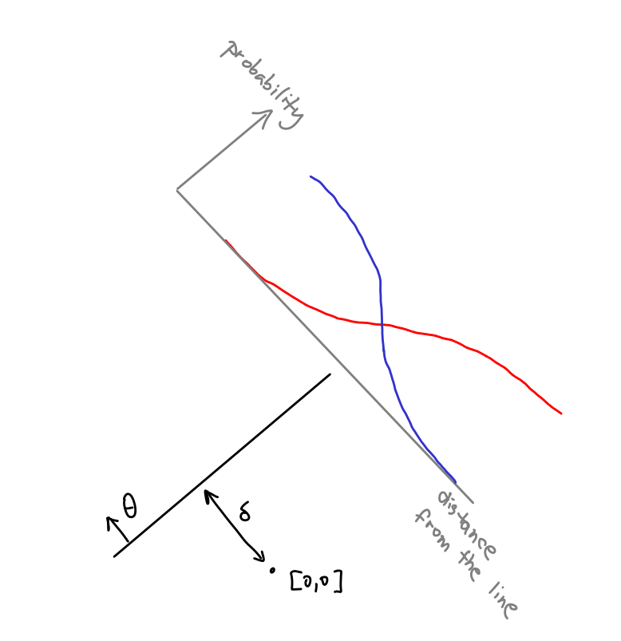

# Loss functions

At last, the final chapter! We will use our new KL superpowers to solve machine learning! Or, at least, understand an important aspect of it -- [setting up loss functions](00-introduction/machine-learning). 

{/*
The essence to take out from this chapter is that when we start with some data and a rough idea about what aspects of it are important to know, KL divergence is guiding us towards a concrete algorithm estimating the aspects. 

In particular, we can use maximum entropy to turn our rough idea into a fully probabilistic model, and maximum likelihood to turn the model into a loss function to optimize. 
*/}

We will go through the examples in the following table (feel free to skip some) and explain where the loss functions are coming from. 

## A catalogue of examples 

<Expand headline = "Estimating mean and variance"> 

Our [basic statistics riddle](00-introduction/statistics) was like this: We have some numbers $X_1, \dots, X_n$ and we want to estimate their mean and variance. 

We have already discussed this riddle from several angles; now we can combine them. 

First, we turn the rough idea that mean and variance are important into a concrete probabilistic model. Maximum entropy principle from [the previous chapter](04-max_entropy) suggests to model the data by being [independent samples](03-minimizing/a-few-observations) from [the normal distribution](04-max_entropy/normal). 

Once we have a set of possible models -- all gaussian distribution -- we can pick the best model out of this set using [the maximum likelihood principle](04-minimizing/mle)<Footnote>In the equations, it will be easier to maximize the logarithm of the likelihood function, i.e., the log-likelihood. This is perhaps not too suprising since [we understand](03-minimizing/mle) that maximizing log-likelihood is really just minimizing the KL divergence, which is fundamentally what's going on here. </Footnote>. 
We [did this in an earlier chapter](04-minimizing/mle_for_mean_sigma), the upshot is that we casted the problem of finding $\hat\mu_{MLE}, \hat\sigma^2_{MLE}$ as the problem of minimizing _loss functions_: 

<Math displayMode={true} math = "\hat\mu_{MLE}, \hat\sigma^2_{MLE} = \argmin_{\mu, \sigma^2} 2N \cdot \log \sigma + \sum_{i = 1}^N \frac{(X_i-\mu)^2}{2\sigma^2}"/>

In this case, the optimization problem has a closed-form formula $\hat\mu_{MLE} = \frac{1}{N} \cdot \sum_{i = 1}^N X_i$ and $\hat\sigma^2_{MLE} = \frac{1}{N} \cdot \sum_{i = 1}^N (X_i-\hat\mu_{MLE})^2$. Thus, we ended up with a formula for the important parameters. Although the formula does not talk about probabilities, they are important to understand what's happening under the hood. 

What I want to stress is how the only assumption we made about the data was at the very beginning, where we said "we have a bunch of numbers, we care about their mean and variance". The rest came automatically from our understanding of KL divergence. In particular, at no point we argued about central limit theorem.

</Expand>
<Expand headline = "Linear Regression"> 

Suppose we are given a list of pairs $(x_1, y_1), \dots, (x_n, y_n)$; we think that the data are roughly linearly dependent, meaning that there are some $a,b$ such that $y_i \approx a\cdot x_i + b$. The task is to find $a,b$. 

Let's turn this into a concrete probabilistic model. Let's model the data as $y_i$ coming from the distribution $a\cdot x_i + b + \text{noise}$. <Footnote>We could also model the distribution from which $x_i$'s are coming, but that's not going to be relevant.</Footnote> 

The noise is generated from a distribution on real numbers -- how do we choose it? The uniform distribution does not normalize on real numbers, so it's not a choice; the same holds for the exponential distribution. The next choice in line is Gaussian $N(\mu, \sigma^2)$, so let's pick that one. This is a bit awkward since we now have two new parameters $\mu, \sigma^2$ in our new model $y_i \sim a\cdot x_i + b + N(\mu, \sigma^2)$, although we don't really care about them; we only care about $a$ and $b$.

But that's ok. First, we can assume that $\mu = 0$, since otherwise we can replace $N(\mu, \sigma^2)$ by $N(0, \sigma^2)$ and $b$ by $b + \mu$ and get the same model of the data. We will get rid of $\sigma$ in a minute. 

Let's now start the third step of our recipe and use the max likelihood principle. We write down the likelihood of our data coming from our model:

<Math displayMode={true} math = "P((x_1, y_1), \dots, (x_n, y_n) | a, b, \sigma^2, x_1, \dots, x_n) = \prod_{i = 1}^n \frac{1}{\sqrt{2\pi\sigma^2}} e^{-\frac{(ax_i + b - y_i)^2}{2\sigma^2}} " />

As is usual, it's easier to think about the log-likelihood (or crossentropy):

<Math displayMode={true} math = "\log P(\text{data} | \text{parameters}) = -\frac{n}{2}\ln(2\pi\sigma^2) - \frac{1}{2\sigma^2} \sum_{i=1}^n (a\cdot x_i + b - y_i)^2"/>

This is pretty complicated, but we notice that whatever value $\sigma^2$ we fix, the optimization problem for $a,b$ becomes to minimize:

<Math displayMode = {true} math = "\hat{a}, \hat{b} = \argmin_{a,b} \sum_{i=1}^n (a\cdot x_i + b - y_i)^2"/>

So, we may forget the added parameter $\sigma^2$<Footnote>Statistical software like R or Python's statsmodels also outputs $\sigma^2$. This can be helpful if you also, given some new point $x_{n+1}$, want not just to predict $y_{n+1}$, but also its error bars. </Footnote> and just optimize this expressions which is the classical [least-squares loss function](https://en.wikipedia.org/wiki/Ordinary_least_squares) for linear regression.<Footnote>Usually, there are more variables $x^1, \dots, x^k$ that we use to predict $y$. This leads to more complicated formula, but the derivation stays the same. </Footnote> Notice how the square in the loss function came from our max entropy assumption of Gaussian noise.

<Expand headline = "Variants of linear regression">

Notice how our approach is pretty flexible so that if we have additional information about the data, we can add it to the model.

For example, maybe we think that the parameters $a$ and $b$ are small. Our framework suggests to add that $a,b \sim N(0, w^2)$ to the model, for some number $w$ that we have to supply by either guessing it or using some other machine learning trick like [cross-validation](https://en.wikipedia.org/wiki/Cross-validation_(statistics)). This leads to optimizing $\sum_{i=1}^n (a\cdot x_i + b - y_i)^2 + \frac{1}{w^2}(a^2 + b^2)$, known as [Ridge regression](https://en.wikipedia.org/wiki/Ridge_regression).

As another example, consider the more general case where we have many predictors $x^1, \dots, x^k$, but we believe that only a small fraction of them, let's say $0 < p < 1$, are actually useful. For the rest, the corresponding coefficient $a_i$ is equal to zero. Our framework suggests that we should optimize:

<Math displayMode={true} math = "\min_{\substack{S \subseteq \{1, \dots, k\}, \\ |S|=pk}} \sum_{i=1}^n \left| \sum_{j \in S} a_j\cdot x_i^j - y_i\right|^2" />

The problem is that optimizing this function is hard (in fact, NP-hard) -- trying all possible subsets of nonzero coefficients and fitting each one of them takes exponential time. Some more complicated math shows though, that optimizing a different objective, called Lasso, often solves this complicated problem<Footnote>See e.g. [10.6 here](https://www.math.uci.edu/~rvershyn/papers/HDP-book/HDP-book.html) or [this book](https://link.springer.com/book/10.1007/978-3-642-20192-9)</Footnote>. So, you should think of Lasso as an attempt to solve our probabilistic model with the assumption that "only a fraction of variables are relevant". 
</Expand>
</Expand>

<Expand headline = "Logistic Regression"> 

This time, we get red and blue points in a plane and we want to find the best line separating them. Ideally, we would like all the red points on one side and all the blue ones on the other, but that's not always possible. In that case, how do we find the best line? 

It will be more helpful to represent the line not as $y = ax+b$, but using the normal vector $\theta$ orthogonal to that line, and the distance $\delta$ of the origin from the line, as in the picture below. <Footnote>Specifically, $\theta = \frac{1}{a^2+1} (a, -1)$ and $\delta = |b|/\sqrt{a^2+1}$, but let's not worry about that. </Footnote>

Given a point $(x, y)$, the relevant quantity is the distance of that point from our line. This can be computed using the dot product as $\theta \cdot (x, y) + \delta$. 

Now, using the max entropy principle, we construct the probabilistic model that converts this distance into color probability. We use the [logistic function](04-max_entropy/logit). That is, our model is
<Math displayMode={true} math = "p(\textrm{red} | (x, y)) = \sigma\left( \lambda (\theta \cdot (x, y) + \delta) \right)"/>
where $\sigma$ is the logistic function $\sigma(x) = e^x / (1+e^x)$. Of course, we also have <Math displayMode={false} math = "p(\textrm{blue} | (x, y)) = 1 - p(\textrm{red} | (x, y)). " /> 

The constant $\lambda$ is a new parameter of our model that max-entropy principle forces us to add to our probabilistic model. Fortunately, it's pretty useful parameter - it captures our confidence about the classification. This is handy because if we want to classify a new point in the future, we can not only color the point red/blue based on which side of the line it is on, but also use the equation ?? to compute how certain we are about our classification. 

Once we have a model, we can use the max likelihood principle to find its parameters. The principle tells us to find $a,b,\lambda$ that minimize the following expression:

<Math displayMode = {true} math = "\argmin_{\theta, \delta, \lambda} \sum_{i = 1}^n \ell_i \log \sigma(\lambda (\theta \cdot (x_i,y_i) + \delta)) + (1-\ell_i) \log (1-\sigma(\lambda (\theta \cdot (x_i,y_i) + \delta)))"/>

where $\ell_i$ is the indicator (i.e. $\ell_i \in \{0,1\}$) for whether the point $(x_i,y_i)$ is red. This problem known as the [logistic regression](https://en.wikipedia.org/wiki/Logistic_regression) is hard to solve exactly, but gradient descent usually works pretty well. 
</Expand>

<Expand headline = "K-means Clustering"> 

We are given a set of points $x_1, \dots, x_n$ on, say, 2D plane. We want to group them into $k$ clusters. 

Let's turn this into a probabilistic model. Let's use $\mu_1, \dots, \mu_k$ to denote centers of the clusters. The meaning of those points is that if a point $x_i$ belongs to the cluster $j$, then their Euclidean distance $||x_i - \mu_j||$ should be small. 

As before, we can use the max entropy distribution to turn this into a concrete model. Exponential function does not normalize, so we will use the normal distribution:

<Math displayMode={true} math = "p(x | \mu_j) \propto e^{-\frac{||x-\mu_j||^2}{2\sigma^2}}"/>

The notation $p(x | \mu_j)$ means that this is only our model distribution of points coming from the $j$-th cluster. We want a full probabilistic model $p(x)$ though. We can get it by putting a prior on how likely each cluster is. The maximum entropy prior is the uniform distribution, so we will choose:

<Math displayMode={true} math = "p(x) = \frac{1}{k} \sum_{i = 1}^k p(x | \mu_j)"/>

We now have a probabilistic model generating data $x$ from a distribution $p$. It is parameterized by $k+1$ numbers: $\mu_1, \dots, \mu_k, \sigma^2$. We will use maximum likelihood to find those parameters. The principle tells us that we should maximize the following log-likelihood:

<Math displayMode = {true} math = "\argmax_{\substack{\mu_1, \dots, \mu_k \\ \sigma^2}} -n \log \left( k\sqrt{2\pi\sigma^2}\right) + \sum_{i = 1}^n  \log \sum_{j = 1}^k e^{-\frac{||x_i-\mu_j||^2}{\sigma^2}}"/>

Optimizing this expression corresponds to an algorithm known as [soft $k$-means](https://en.wikipedia.org/wiki/Fuzzy_clustering) (TODO check). The word "soft" is there because the parameter $\sigma$ enables us to output a distribution for each point $x$ telling us how likely it is that $x$ comes from each cluster. 

In practice, people don't care that much about this; knowing the closest cluster is enough. This corresponds to being interested in the limit $\sigma \rightarrow 0$. In this limit, the beastly expression ?? simplifies pretty nicely. In particular, we can replace the summation <Math math = "\sum_{j = 1}^k e^{-\frac{||x_i-\mu_j||^2}{2\sigma^2}}" /> by <Math math = "\max_{j = 1}^k e^{-\frac{||x_i-\mu_j||^2}{2\sigma^2}}" /> since all other terms in the sum expect the largest one are simply negligible if we think of $\sigma \rightarrow 0$. The expression ?? simplifies to this:

<Math displayMode = {true} math = "\argmin_{\substack{\mu_1, \dots, \mu_k}} \sum_{i = 1}^n \min_{j = 1}^k ||x_i-\mu_j||^2"/>

The problem of finding $\mu_1, \dots, \mu_k$ that minimize this expression is called [$k$-means](https://en.wikipedia.org/wiki/K-means_clustering). 
</Expand>
<Expand headline = "Classification by neural nets"> 

We are given a huge number of images, and each one has one of $k$ possible labels (a dog, a muffin, ...). We want to optimize a neural net that takes an image on the input and outputs a probability distribution over the $k$ possible classes. 

Coming up with an architecture of a neural net is a very tricky problem that we cannot hope to "solve" just by using our tools. But maximum entropy helps at least a little bit: [we already discussed](04-max-entropy/softmax) that the last layer of the network is typically just converting logits into probabilities by softmax. That is, if we build a neural net that transforms input image $X$ to $k$ numbers $NN_1(X), \dots, NN_k(X)$, we should map them into probabilities as <Math math = "p_j(X) \propto e^{-\lambda NN_j(X)}" />. The constant $\lambda$ can be optimized together with the network, or just hardcoded to $1$.  

Next, the maximum-likelihood principle says that we should maximize the log-likelihood, i.e., if on image $X_i$ with label $\ell_i$ the net outputs a distribution $p_1(X_i), \dots, p_k(X_i)$, we should try to maximize
<Math displayMode={true} math = "\argmax_{\substack{\textrm{neural net \\ weights}}} \sum_{i = 1}^n \log p_{\ell_i}(X_i)"/>

Maximizing the log-likelihood is the same as minimizing cross-entropy ([as we discussed in this chapter](03-minimizing/mle)), so in this case, we usually talk about this as "we train the network by minimizing the cross-entropy loss <Math math = "\sum_{i = 1}^n \log 1/p_{\ell_i}(X_i)" />". 
</Expand>
<Expand headline = "Variational Autoencoders"> 

[todo example series of pictures interpolating in the latent space]
[nebo widget kde můžu prohnat obrázek zašuměním + odšuměním]

Here's an observation that's also relevant to the previous example. When we store images on hard drive, we do that pixel by pixel, i.e., in the _pixel space_. But in our brain, we store them very differently, perhaps we remember that "it was a picture of a brown dog that looked like a muffin" or something like that. This corresponds to using the so-called _latent space_. This is a hypothesised space where two images are close if they refer to similar objects. For example, two images are close in the latent space even though in the pixel space they might be extremely far. 

Being able to represent the latent space is the key to any interesting work on images. In fact, the reasons why we were able to separate dogs and muffins in the previous example was that the inner layers of the network were able to access concepts in the latent space like "are there ears on the picture". 

As the next step, we now want a system that can not only classify images, but also generate new ones from scratch (think DALLE or Midjourney) or do the cool trick above where we interpolate between two images _in the latent space_. The basic approach to do that is called _autoencoders_. 

Autoencoder (see below) is a neural network architecture that feeds an input image $x$ through an encoder $\textrm{Enc}(x)$ and compresses it to a smaller list of numbers $y$. Then, we use the decoder $\textrm{Dec}(y)$ that tries to reconstruct the original image $x$. The hope is that due to the bottleneck in the middle, $y$ represents the important aspects of the image $x$, and forgets the less important ones. In other words, the hope is that encoder is encoding the image into the latent space. 

One problem of autoencoders is that they often learn a "hash function": The decoder memorizes all images $x_1, x_2, \dots$ and the encoder & decoder decides on "names" of the images. Then encoder just converts an input image to its name, and the decoder outputs the image with that name. To fight this problem, practitioners use _variational autoencoders_. These are autoencoders where the encoder outputs two lists $\mu_1, \dots, \mu_d$ and $\sigma^2_1, \dots, \sigma^2_d$. The input to the decoder are $d$ samples from $N(\mu_1, \sigma_1^2), \dots, N(\mu_d, \sigma_d^2)$. By adding the noise in the middle of the architecture, it gets harder for the net to cheat by storing all images. 

The big question is: How do we now optimize the variational autoencoder? In particular, what's the loss function to optimize? Let's try to derive it! It's going to be harder than previous examples, so it will hopefully showcase what we learned in this minicourse!

How do we start? The first item on our todo list is to come up with a probabilistic model of our data. In this example, we are interested in the joint distribution $p(x, y)$ over images -- the first variable $x$ represents that image in the pixel space, and $y$ represents it in the latent space. Notice that we work with a probability distribution - a particular $y$ corresponds to a whole distribution over images that capture the concept $y$, it's not just one image. 

Now, the encoder and the decoder represent two ways in which we can factorise the joint distribution. 
The encoder corresponds to the factorization $p(x,y) = p(x) \cdot p(y | x)$: First sample a random image and then encode it to the latent space. The distribution $p(x)$ is known to us: it's the empirical distribution over a large dataset of images that we collected to train our autoencoder. 
The distribution $p(y | x)$ is unfortunately not known, but the encoder tries to represent it. More precisely, the distribution $p(y | x)$ is approximated by the distribution <Math math = "p'(y | x) = N(\textrm{Enc}_\mu(x), \textrm{Enc}_{\sigma^2}(x)" />. 

The decoder gives us a second way to model the data: We first sample a random latent-space representation and then decode it to the image, i.e., $p(x,y) = p(y) \cdot p(x|y)$. We have to be more creative though to turn this idea into a concrete probabilistic model. For start, we don't know the marginal distribution $p(y)$; so we will just model it with a gaussian model $q(y) = N(0, I)$ ($I$ stands for unit matrix). How should we model $p(x|y)$? Using $\textrm{Dec}(y)$ is a good start, but we should also add some randomness, so let's add the gaussian noise $N(0,1)$ to every pixel of the final image and model it as $q(x|y) = N(\textrm{Dec}(y), I)$. We have arrived at a different probabilistic model of $p(x,y) = q(y) \cdot q(x|y)$. 

We will optimize our variational autoencoder by minimizing the KL divergence between these two models of $p(x,y)$. When we use KL divergence, we like to have the first parameter correspond to the "truth" and the other is a model of it. This time, both distributions are models that we are going to train in unison. But the first model $p(x,y) = p(x) \cdot p'(x|y)$ is closer to the truth, since it contains the actual data $p(x)$, while the second model is just a heap of parameters we want to optimize. So, we will train our net by minimizing this: 

<Math displayMode={true} math = "D\left( p(x) \cdot p'(x | y), q(y) \cdot q(y|x)\right)" />

Finishing the job now reduces to algebra left to an Expand box:
<Expand headline = "Algebra part">
Let's call our KL loss function $\mathcal L$. We can split it into two parts, called the reconstruction loss and regularization term like this:  
<Math displayMode = {true} math = "\mathcal L = \underbrace{\sum_{x,y} p(x) p'(y|x) \log \frac{p(x)}{q(x|y)}}_{\textrm{Reconstruction loss } \mathcal L_1} + \underbrace{\sum_{x,y} p(x) p'(y|x) \log \frac{p'(y|x)}{q(y)}}_{\textrm{Regularization term } \mathcal L_2} "/>

Let's analyze the two terms in turn, starting with the reconstruction loss. 

### Reconstruction Loss
We can split the term $\mathcal L_1$ further like this: 
<Math displayMode={true} math = "\mathcal L_1 = \sum_x p(x) \log p(x) - \sum_{x,y} p(x) p'(y|x) \log q(x|y)"/>
The first term is simply the entropy of the distribution $p(x)$. In our case, $p(x)$ is uniform distribution over $N$ images $X_1, \dots, X_N$, so it's equal to $\log N$. In any case, this term is a constant independent of all the parameters we optimize, so we can as well forget it. Thus, minimizing $\mathcal L_1$ amounts to minimizing the other term which we will now interpret. 

To do this, recall that $q(x|y)$ runs the decoder on $y$ and adds gaussian noise $N(0,1)$ to the result; we thus have 
<Math displayMode={true} math = "q(x | y) \propto e^{-\| x - \textrm{Dec}(y)\|^2}{2d}"/> 
and hence, up to additive constant that does not play a role in our optimization problem, we have
<Math displayMode={true} math = "\log q(x | y) = -\frac{\| x - \textrm{Dec}(y)\|^2}{2d}"/> 

So, if we were in the setup of a regular autoencoder where $p'(y|x)$ is a deterministic encoding $\textrm{Enc}(x)$, minimizing the term $\mathcal L_1$ would boil down to minimizing the mean square _reconstruction_ loss 
<Math displayMode={true} math = "\frac{1}{N}\sum_{i = 1}^N \frac{\| X_i - \textrm{Dec}(\textrm{Enc}(X_i))\|^2}{2d}. " /> 

Our case is more complicated, we have to minimize this:
<Math displayMode={true} math = "\frac{1}{N}\sum_{i = 1}^N \sum_{y} p'(y|X_i) \frac{\| X_i - \textrm{Dec}(y)\|^2}{2d}. " /> 

The term $p'(y|x)$ that samples from <Math math = "N(\textrm{Enc}_\mu(x), \textrm{Enc}_{\sigma^2}(x))" /> instead of being a deterministic encoding is problematic to compute. We will discuss in the end how to estimate this part of the loss function. 

### Regularization term

Let's analyze the term <Math math = "\mathcal L_2 = \sum_{x,y} p(x) p'(y|x) \log \frac{p'(y|x)}{q(y)}" />. Remember, $p(x)$ is just a uniform distribution over our image dataset, so we can rewrite this as
<Math displayMode={true} math = "\mathcal L_2 = \sum_{i = 1}^N \frac{1}{N} \sum_y p'(y|x) \log \frac{p'(y|x)}{q(y)} = \sum_{i = 1}^N \frac{1}{N} D(p'(y|x), q(y))"/>
So, minimizing this term boils down to minimizing the sum of KL divergences between $p'(y|X_i)$ and $q(y)$ over our dataset $X_1, \dots, X_N$. 

The first distribution $p'(y |X_i)$ is simply a gaussian with mean $\textrm{Enc}_\mu(X_i)$ and variance being the diagonal matrix with entries <Math math = "\textrm{Enc}_{\sigma^2}(X_i)" />. The second distribution $q(y)$ is literally the gaussian $N(0,1)$. There's a [simple formula](https://leenashekhar.github.io/2019-01-30-KL-Divergence/) for the KL divergence between two gaussians that looks like this:
<Math displayMode = {true} math = "D(N(\mu, \sigma^2), N(0, 1)) = \frac12 \sum_{i = 1}^d \left( \mu_i^2 + \sigma_i^2 - 1 - \log\sigma_i^2\right) "/>

Plugging it to $\mathcal L_2$, we get that we have to minimize the expression 
<Math displayMode = {true} math = "\frac{1}{N} \sum_{i = 1}^N \left( \frac12 \sum_{j = 1}^d \textrm{Enc}_{\mu, j}(X_i)^2 + \textrm{Enc}_{\sigma^2, j}(X_i) - \log \textrm{Enc}_{\sigma^2, j}(X_i) \right)"/>
</Expand>

After we do the algebra, we end up with the loss function
<Math displayMode={true} math = "\frac{1}{N} \sum_{i = 1}^N \left( \sum_y p'(y | x) \frac{\| X_i - \textrm{Dec}(y)\|^2}{2d} \,+\, \left( \frac12 \sum_{j = 1}^d \textrm{Enc}_{\mu, j}(X_i)^2 + \textrm{Enc}_{\sigma^2, j}(X_i) - \log \textrm{Enc}_{\sigma^2, j}(X_i) \right)\right)"/>

In general, computing the expression <Math math = "\sum_{i = 1}^N \sum_y p'(y | x) \frac{\| X_i - \textrm{Dec}(y)\|^2}{2d}"/> is incredibly hard since we would have to iterate overall the whole range of $p'(y|x)$. In practice, this expression can be estimated well-enough by the Monte Carlo method. 

That is, in practice we can optimize this loss function. For each image $X_i$, we just sample a few times from $p'(y|X_i)$ and compute the reconstruction loss $\| X_i - \textrm{Dec}(y)\|^2$ for them. We also add the regularization term involving the mean and variance spit out by the decoder; this is to make sure that our variational autoencoder does not set $\sigma_i^2 = 0$ to become a vanilla autoencoder. 
</Expand>

## What's next

You are the master of KL, congrats! If you want to continue, we cover a few more bits and pieces [in the next chapters](06-algorithms). You can also check out [Resources](/resources) or leave us feedback at the [About](/about) page.
